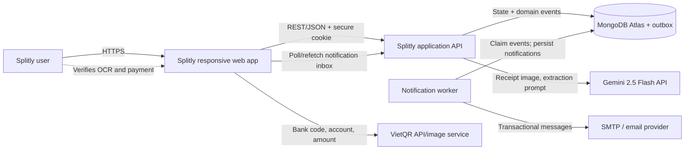
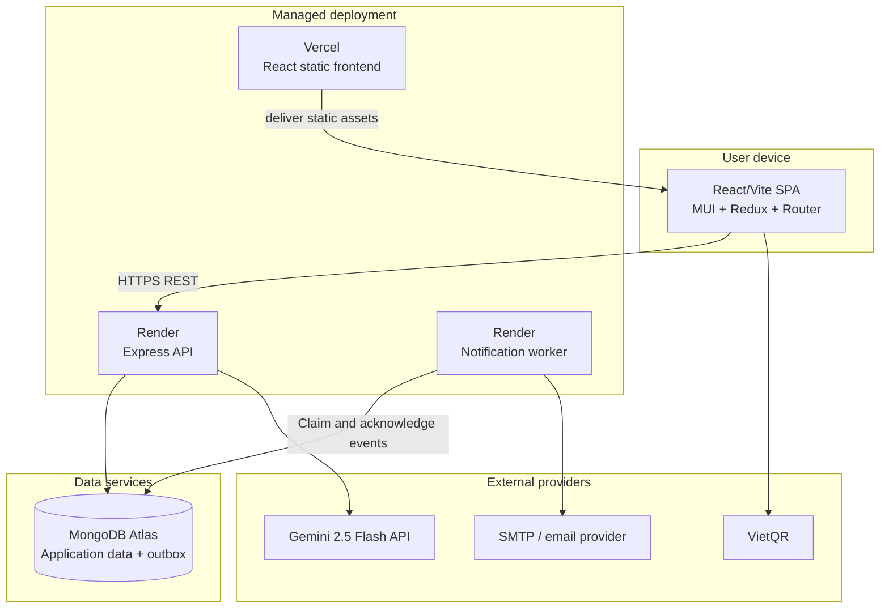
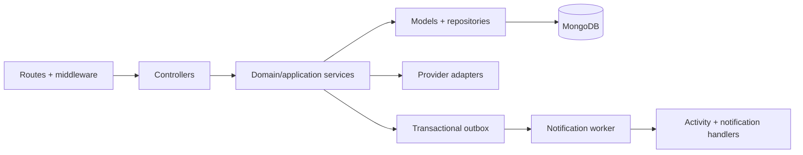
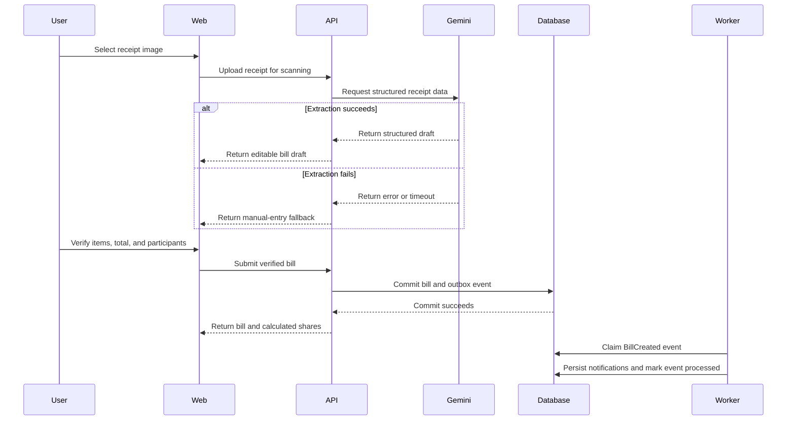
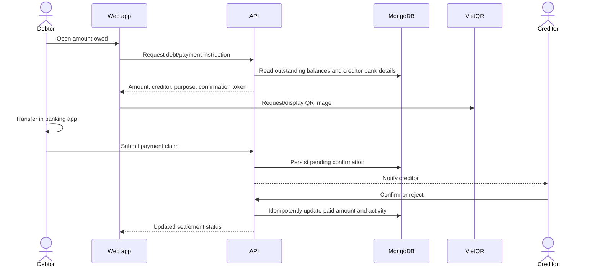

# Splitly Software Architecture and Design

## 1. Executive Summary

Splitly is a responsive web application that turns a receipt into a transparent settlement: scan or enter a bill, verify the extracted data, assign items to participants, distribute tax/fees/discounts, calculate each share, and show who owes whom.

The proposed MVP uses a **modular monolith** rather than microservices. A React single-page application communicates with one Node.js/Express API, which organizes business capabilities into routes, controllers, services, and MongoDB models. MongoDB stores users, groups, bills, item allocations, payment state, activities, notifications, and transactional outbox events. Gemini 2.5 Flash, VietQR, and email are external adapters at the system boundary. Business state and its event are committed atomically; a notification worker processes the outbox asynchronously so external delivery cannot reverse or falsify the committed bill/payment state.

This is the best fit for a six-member, ten-week greenfield project: one backend codebase keeps transactions, debugging, testing, and operating cost manageable, while the API and worker run as separate processes from the same backend codebase. The worker improves reminder and payment-notification reliability without introducing microservices or a separate message broker.

## 2. Goals, Scope, and Architecture Drivers

### 2.1 MVP goals

1. Complete the simplest reliable flow: create group -> enter/scan bill -> verify -> assign items -> calculate shares -> show debt -> track payment.
2. Make every monetary result explainable and preserve the invariant that allocated shares equal the bill total.
3. Keep the product usable when OCR, VietQR, event delivery, or email is unavailable.
4. Protect receipt contents, identity data, bank details, and group financial data.
5. Deliver a usable mobile and desktop experience without maintaining two native applications.

### 2.2 In scope

* Email registration, verification, login, logout, and profile/bank-detail management.

* Group and member management.

* Manual, equal, per-person, and item-based bill entry.

* Receipt image validation, resizing, Gemini 2.5 Flash extraction, and human correction.

* Shared-item assignment and proportional distribution of the difference between item subtotal and final total.

* Debt summary, cross-bill debt clearing with explainable net payment instructions, payment reminders, confirmation, and paid/unpaid status.

* VietQR image generation, activity history, essential dashboard status, email, and in-app/real-time notifications.

### 2.3 Out of scope for the MVP

* Native iOS/Android applications and offline synchronization.

* Direct bank transfer initiation, bank-webhook reconciliation, or custody of funds.

* Microservices, event sourcing, Kafka, and Elasticsearch.

* Multi-currency conversion and accounting-grade ledger features.

* Long-term storage of receipt images.

* Automatic acceptance of OCR results without user verification.

* PDF receipt input, advanced reports, the TingTing chatbot, and AI payer recommendation.

* Separate message broker such as Kafka or RabbitMQ; the MVP uses MongoDB as the transactional outbox store.

### 2.4 Quality priorities

| Priority                     | Architectural consequence                                                                                                        |
| ---------------------------- | -------------------------------------------------------------------------------------------------------------------------------- |
| Correctness and transparency | Server-side calculation is authoritative; inputs and totals are validated; rounding remainders are deterministic.                |
| Privacy and security         | Least-data receipt handling, authenticated APIs, resource authorization, secure cookies, redacted logs, and encrypted transport. |
| Availability                 | Manual entry is always available; failures of optional integrations do not block bill creation or settlement records.            |
| Delivery speed               | One frontend and one modular backend, familiar JavaScript stack, managed database, and simple deployment.                        |
| Maintainability              | Capability-based modules and provider adapters prevent external APIs from leaking into domain logic.                             |

## 3. Architecture Decisions

| Decision                  | Choice                                                                   | Rationale and trade-off                                                                                                                                                                          |
| ------------------------- | ------------------------------------------------------------------------ | ------------------------------------------------------------------------------------------------------------------------------------------------------------------------------------------------ |
| Application type          | Responsive web application/PWA-ready SPA                                 | One codebase covers phones and desktops and supports camera/file upload. Native-only capabilities and app-store distribution are not necessary for the MVP.                                      |
| Backend style             | Modular monolith                                                         | Lowest operational overhead and easiest consistency model for a small team. Module boundaries allow later extraction without paying distributed-system cost now.                                 |
| Frontend                  | React + Vite, React Router, Redux Toolkit, MUI/Tailwind                  | Supports responsive forms and fast iteration. Exact compatible versions are frozen during project setup; disciplined state ownership avoids duplicated calculation rules.                        |
| API                       | Node.js + Express REST API                                               | Uses one team language across web/API. HTTP controllers remain thin; domain work belongs in services.                                                                                             |
| Database                  | MongoDB Atlas                                                            | Fits bill aggregates with embedded items and payment status. Cross-document workflows still need explicit consistency handling and indexes.                                                       |
| Notification delivery     | Transactional outbox and asynchronous notification worker                | Bill/payment state and its notification intent commit atomically. The worker provides retry and idempotency without delaying the user-facing request.                                             |
| OCR                       | Gemini 2.5 Flash API behind a provider adapter                           | Centralizes credentials and request mapping. OCR output is untrusted draft data and must be parsed, validated, and confirmed by a user.                                                          |
| QR payment                | VietQR-generated QR image/instruction                                    | Speeds transfer entry without making Splitly a payment processor. Payment completion still requires confirmation.                                                                                |
| Event-driven architecture | Durable domain events through a MongoDB transactional outbox              | A worker claims events and creates notifications with retry and idempotency. A separate broker remains unnecessary for MVP throughput.                                                            |
| Event sourcing            | Not used                                                                 | Canonical documents plus append-only activities meet MVP traceability needs. Rebuilding all financial state from events adds schema and operational complexity without MVP value.                  |
| Deployment                | Vercel frontend; Render API and worker; MongoDB Atlas                     | Uses managed services while allowing the API and background worker to run independently. Render process availability, cost, and cold-start behavior must be verified before UAT.                    |

### 3.1 Technology stack baseline

| Layer              | Technology                                          | Role                                                                        |
| ------------------ | --------------------------------------------------- | --------------------------------------------------------------------------- |
| Web                | React 19, Vite 7, React Router 7                    | Single-page application, routing, responsive user workflows                 |
| UI and state       | Material UI 7, Tailwind CSS 4, Redux Toolkit, Axios | Components/theme, client state, and HTTP access                             |
| API                | Node.js 18+, Express 5, Babel                       | Versioned REST endpoints and application orchestration                      |
| Validation/media   | Joi, `file-type`, Sharp                             | Request schemas, MIME inspection, and receipt resizing                      |
| Data               | MongoDB driver/ODM, MongoDB Atlas                    | Canonical state, notifications, and transactional outbox events              |
| Identity           | JWT HS256, bcrypt, secure HTTP cookies              | Authentication and password protection                                      |
| Async notifications| MongoDB transactional outbox + Node.js worker       | Durable event processing, retry, idempotency, and notification delivery      |
| AI receipt input   | Gemini 2.5 Flash API                                | Structured receipt-draft extraction                                         |
| Payment assistance | VietQR image/bank APIs                              | QR payment instructions; no fund custody                                    |
| Messaging          | SMTP/Nodemailer-compatible provider                 | Verification, reminders, and transactional email                            |
| Delivery           | GitHub Actions, Vercel, Render                      | Automated checks and managed frontend/backend deployment                     |

## 4. System Context



### Trust boundaries

* The browser is untrusted. Client-side route guards and calculations improve UX but never replace server validation or authorization.

* The API is the policy enforcement point and owns authoritative calculation and persistence.

* MongoDB is private infrastructure; it is never accessed directly by the browser.

* Gemini, VietQR, and mail services are third parties. Data sent to them is minimized, timed out, and treated as potentially unavailable.

* Splitly creates payment instructions and records confirmations; it does not move money or prove that a bank transfer occurred.

## 5. Container and Deployment View



The proposed delivery pipeline runs tests and builds before deploying the frontend to Vercel and the API plus notification worker to Render. The API and worker use the same backend artifact but separate start commands and health/operational checks. MongoDB Atlas remains private to the backend processes. Environment secrets, CORS, worker liveness, outbox backlog, Render cold starts, service-plan limits, and rollback behavior must be verified before UAT.

## 6. Backend Module Design

The backend is one deployable codebase with two process roles—the HTTP API and notification worker—and the following internal layers:



| Module              | Responsibilities                                                                 | Primary persisted data                                           |
| ------------------- | -------------------------------------------------------------------------------- | ---------------------------------------------------------------- |
| Identity            | Registration, verification, login/logout, and profile                            | `users`                                                          |
| Groups              | Group lifecycle, membership, group/bill association                              | `groups`                                                         |
| Bills               | Bill validation, split calculation, item assignment, and settlement state         | `bills`                                                          |
| Debts and payments  | Bill-level obligations, reminders, payment submission and confirmation           | `payment_reminders`, `payment_confirmations`, bill payment state |
| Activity/history    | Human-readable audit trail and bill history                                      | `activities`                                                     |
| Notifications       | Outbox handlers, persisted inbox, Socket.IO/email dispatch, retry, and failure state | `notifications`, `outbox_events`                              |
| Dashboard           | Derived essential spending and debt-status summaries                              | Reads bills/users; no separate source of truth                   |
| AI receipt input    | Gemini 2.5 Flash request orchestration and structured receipt draft              | No receipt image persistence in the target design                |
| Providers           | JWT, Gemini, SMTP/email, and VietQR adapters                                      | Secrets in runtime configuration only                            |

### Dependency rules

1. Routes select middleware and controllers; they contain no business rules.
2. Controllers translate HTTP input/output and delegate to services.
3. Services own calculations, access-policy decisions, orchestration, and transaction boundaries.
4. Models own schema validation, identifier conversion, indexes, and persistence queries.
5. Provider-specific request/response formats remain behind adapters.
6. Dashboard summaries derive data from canonical bill/payment records and do not mutate them; advanced reports are post-MVP.
7. Services write a domain event to the outbox in the same transaction as authoritative business state. The worker owns external notification side effects and idempotent retries; it never recalculates or reapplies a payment.

### Notification event model

The following domain events define notification intent. The API writes them to the MongoDB outbox and the worker handles them after the originating transaction commits.

| Domain event               | Produced when                                 | Notification handler result                                      |
| -------------------------- | --------------------------------------------- | ---------------------------------------------------------------- |
| `BillCreated`              | A verified bill and calculation are committed | Notify non-creator participants and create activity entries      |
| `BillUpdated`              | Bill details, assignments, or deadline change | Notify affected participants with the changed fields             |
| `PaymentSubmitted`         | A debtor submits a payment claim              | Notify the creditor to confirm or reject                         |
| `PaymentConfirmed`         | A creditor confirms payment                   | Notify payer and affected participants; refresh settlement state |
| `PaymentRejected`          | A creditor rejects a payment claim            | Notify payer with a safe reason and next action                  |
| `PaymentReminderRequested` | A creditor requests a reminder                | Create in-app notification and enqueue email delivery            |
| `GroupMemberAdded`         | A member joins a group                        | Notify the new member and relevant group members                 |

Outbox delivery is **at least once**. Every event has a unique `eventId`; each handler records that ID or uses a unique derived key so a retry cannot create duplicate notifications or apply a payment twice. Payloads are versioned and contain references plus minimal display data, never raw receipt images, credentials, or full user records.

## 7. Core Runtime Flows

### 7.1 Scan, verify, and create a bill



**MVP security requirement:** the receipt-scan endpoint requires authentication, ownership and rate checks, a request timeout, upload validation, and a normalized Gemini response contract. These are acceptance requirements, not claims about an existing route.

### 7.2 Item allocation and charge distribution

For each item `i`, the item base is:

```text
itemBase[i] = quantity[i] * unitPrice[i]
memberItemShare[i] = itemBase[i] / numberOfAssignedMembers[i]
```

Let `subtotal` be the sum of item bases and `finalTotal` include tax, service fee, tip, and discount. The proposed calculation uses an adjustment ratio for item-based splitting:

```text
adjustmentRatio = finalTotal / subtotal
memberTotal[m] = sum(memberItemShare[i] * adjustmentRatio for items assigned to m)
```

This proportionally distributes both surcharges and discounts according to consumption. Before saving, the server must enforce:

* At least one participant and one payer; both belong to the bill/group.

* Positive item quantity and price; every included item has at least one assignee.

* `subtotal > 0` for an item-based split.

* All monetary values use integer VND (or explicit minor units), never binary floating point as canonical storage.

* `sum(memberTotal) == finalTotal` after rounding. Assign the remainder deterministically (recommended: payer, then stable user ID) and expose it in the breakdown.

* A submitted client total is advisory; the backend recalculates and rejects unexplained mismatches.

**Required contract:** use `unitPrice` consistently, calculate `quantity * unitPrice` on the server, and use the same fixtures for API and UI verification. The frontend may preview a result but cannot be the authoritative calculator.

### 7.3 Settle up



QR generation failure falls back to plain bank name, account number, amount, and transfer content. A QR being displayed or scanned never marks a debt as paid.

## 8. Data Design

MongoDB documents follow aggregate boundaries and references use `ObjectId`. The minimum architecture-level model is self-contained below; detailed schemas must be derived and versioned during implementation.

| Aggregate/collection           | Key fields                                                                                       | Notes                                                                                                       |
| ------------------------------ | ------------------------------------------------------------------------------------------------ | ----------------------------------------------------------------------------------------------------------- |
| User / `users`                 | id, email, name, password hash, verification state, bank code/account, timestamps                | Never return password or verification token in normal projections. Bank data is sensitive.                  |
| Group / `groups`               | id, creatorId, memberIds, billIds, name, timestamps                                              | Membership controls access to group bills.                                                                  |
| Bill / `bills`                 | id, creatorId, payerId, participants, items, final total, split method, payment status, deadline | Canonical calculation and settlement aggregate. Embed the immutable calculation breakdown used at creation. |
| Activity / `activities`        | actor, type, resource, safe details, timestamp                                                   | Append-only audit-oriented record; not event sourcing. Do not store secrets or raw receipt content.         |
| Notification / `notifications` | recipient, actor, type, resource, read state, timestamp                                          | Created idempotently by event handlers and retrieved through the notification API.                          |
| Outbox event / `outbox_events` | eventId, type, aggregateId, version, payload, status, attempts, availableAt, processedAt          | Durable handoff from the business transaction to notification/activity handlers.                            |
| Payment reminder               | token hash, debtor, creditor, expiry, usedAt                                                     | Token should be single-use, short-lived, and stored hashed.                                                 |
| Payment confirmation           | payment reference, payer, recipient, amount, decision, timestamp                                 | Enforce uniqueness/idempotency for repeated callbacks/submissions.                                          |

### Data consistency

* Business state and its outbox event are committed in one MongoDB transaction. Notification and activity handlers run after commit and do not delay the user-facing request.

* A worker atomically claims an event, applies idempotent handlers keyed by `eventId`, and marks it processed. Transient failures use exponential backoff; exhausted events move to a failed/dead-letter state for review.

* Payment submissions and confirmations use idempotency keys or unique business constraints. Retried events cannot mutate the monetary result twice.

* Updates use resource filters that include the authorized user/group, not only `_id`.

* Soft-deleted records are excluded consistently. Financial activities and confirmations use retention rules rather than casual deletion.

* Indexes cover user email, bill creator/payer/participants/status/date, group creator/members, and activity timeline. Add unique indexes for external/single-use tokens.

## 9. Receipt Image Lifecycle and Privacy

The safest MVP policy is **transient processing**:

1. The browser previews the selected file locally.
2. The API accepts only JPG/JPEG, PNG, and WebP up to 10 MB, checks the real MIME signature, applies dimension/aspect-ratio limits, and resizes oversized dimensions when safe. PDF is rejected and remains post-MVP.
3. The image is held in memory only long enough to call Gemini 2.5 Flash. It is not written to MongoDB, application logs, or permanent object storage.
4. Only the user-verified structured fields needed for the bill are saved.
5. Buffers and request references are released after success or failure; provider retention is governed by the provider agreement and disclosed in the privacy notice.

If future product requirements need image retention, use private object storage, encryption, per-bill authorization, short-lived signed URLs, malware/content checks, an explicit retention period, and user deletion controls. Do not embed base64 receipts in MongoDB bill documents.

## 10. External Integration Contracts and Fallbacks

| Dependency          | Normal path                                                    | Failure policy                                                                                                                               | Data minimization                                                                                         |
| ------------------- | -------------------------------------------------------------- | -------------------------------------------------------------------------------------------------------------------------------------------- | --------------------------------------------------------------------------------------------------------- |
| Gemini 2.5 Flash    | Multimodal request returns a structured receipt draft          | Short timeout; at most one bounded retry with jitter for transient errors; return recoverable status; preserve user form; offer manual entry | Send receipt image and extraction prompt only; never send password, bank account, or unrelated group data |
| VietQR              | Render QR from bank code/account, amount, and transfer content | Display copyable payment instructions; allow regeneration; never change payment state                                                        | Send only fields required to encode payment instruction                                                   |
| SMTP/email          | Send verification, reminder, and payment notifications         | Persist in-app notification first; record delivery error; allow bounded idempotent retry; do not roll back a valid bill                       | Email address plus minimum message content                                                                |
| Domain-event outbox | Deliver bill/payment events to notification handlers           | Retry with backoff; idempotent handler; failed/dead-letter state after the configured attempt limit; alert on event age                      | Event payload contains identifiers and minimum display fields, not receipt images or secrets              |
| MongoDB             | Read/write canonical application state                         | Fail request safely; no false success; health monitoring, backups, and tested restore                                                        | Private network and least-privilege database user                                                         |

Provider adapters must map errors to stable internal codes such as `OCR_UNAVAILABLE`, `OCR_INVALID_RESPONSE`, and `EMAIL_DELIVERY_DEFERRED`; raw provider responses and credentials must not reach the browser or logs.

## 11. API Design

The proposed API is versioned under `/v1`. MVP resource families include users, groups, bills, debts, payment confirmation, activities, history, dashboard status, notifications, and receipt scanning. Advanced reports and assistant functions are post-MVP.

### Contract conventions

* JSON requests/responses; consistent `{ data, error, meta }` envelope is the target contract.

* Joi validates shape and limits at the HTTP boundary; domain services validate business invariants.

* Authentication identity comes from the verified JWT, never a trusted `userId` body/path field.

* Authorization checks membership/ownership for every resource read or mutation.

* Pagination is mandatory for list/history/activity endpoints.

* Mutation endpoints accept an idempotency key where retries can duplicate a payment or notification.

* Error responses use stable codes and safe Vietnamese user messages; stack traces remain server-side.

* `/v1/status` is the planned liveness check; a readiness check verifies MongoDB and critical configuration.

### High-risk route requirements before release

Receipt scanning, history, payment, reminder, and notification routes require authenticated resource authorization. Any intentionally public payment-confirmation flow requires a purpose-specific high-entropy token, hashed storage, expiry, single use, rate limiting, and minimal responses. Diagnostic or test-email routes must not be exposed in the release environment.

## 12. Security Architecture

### Authentication and session

* Keep JWT access tokens in `HttpOnly`, `Secure`, `SameSite` cookies with short expiry; rotate/revoke refresh credentials if refresh tokens are introduced.

* Hash passwords with bcrypt using an approved work factor and never log credentials/tokens.

* Apply login, registration, OCR, AI, email, and token-verification rate limits.

* Require verified identity for financial and group operations in the MVP.

### Authorization

* Derive the actor ID from `req.jwtDecoded`; reject mismatched `creatorId`, `userId`, payer, or participant claims.

* Enforce group membership and bill participation in service/repository queries.

* Only the creditor/authorized group member can confirm a payment; confirmation is idempotent and auditable.

* Web route protection is UX only; all enforcement happens in the API.

### Application and infrastructure

* Enforce HTTPS, production CORS allow-list, security headers, request/body limits, and CSRF protection for cookie-authenticated mutations.

* Validate actual upload type, not filename; never execute uploaded content.

* Store secrets in deployment secret storage, not source or client environment variables; rotate exposed credentials.

* Redact authorization headers, cookies, bank accounts, receipt images, OCR payloads, and personal data from logs.

* Encrypt backups and database/provider traffic; restrict database network access and credentials.

* Maintain dependency scanning, lockfiles, protected deployment secrets, backup/restore tests, and incident procedures.

## 13. Reliability, Performance, and Observability

### Initial service targets

| Area             | MVP target                                                                                            |
| ---------------- | ----------------------------------------------------------------------------------------------------- |
| Core API         | p95 under 500 ms for ordinary authenticated reads/writes, excluding external providers                |
| Bill calculation | Under 200 ms for up to 100 items and 50 participants                                                  |
| OCR              | User-visible progress; timeout within 30 seconds; manual fallback always available                    |
| Availability     | Core bill/settlement records remain usable when Gemini, email, the notification worker, or VietQR fails; queued events resume later |
| Correctness      | 100% of calculation fixtures preserve `sum(shares) == finalTotal`; idempotent payment confirmation    |
| Recovery         | Daily backup at minimum; documented and tested restore before production acceptance                   |
| Accessibility    | Keyboard-operable forms/dialogs, labeled controls, readable errors, and WCAG AA color contrast target |

### Observability

* Structured logs with request/correlation ID, route, duration, status, internal error code, and provider latency.

* Metrics for request/error rate, p95 latency, MongoDB pool health, Gemini success/invalid/timeout rate, outbox depth/age, worker retries/failed events, email delivery, and calculation invariant failures.

* Alerts on elevated 5xx rate, database unavailability, sustained OCR failure, and failed backup.

* Audit activities record relevant actor/action/resource/result without storing sensitive payloads.

## 14. UX Routes and Architecture Traceability

| Route/screen                       | Workflow responsibility                                    | Main API/data dependency                              | Failure/fallback                                       |
| ---------------------------------- | ---------------------------------------------------------- | ----------------------------------------------------- | ------------------------------------------------------ |
| `/login`, `/register`              | Establish verified identity                                | Users/auth                                            | Clear validation; retry verification safely            |
| `/groups`, `/groups/:groupId`      | Create group, add/manage members                           | Groups, users                                         | Bill creation can still select individual participants |
| `/ocr`                             | Select, validate, and scan receipt                         | Gemini 2.5 Flash through `/v1/bills/scan`             | Retry or continue to `/create` manually                |
| `/create`                          | Verify/edit OCR, choose payer, assign items, split charges | Bills, users/groups; authoritative calculation on API | Preserve draft and show field-level mismatch           |
| `/bills/:billId`, `/history`       | Explain bill and audit prior records                       | Bills/history/activity                                | Read-only cached shell; safe retry                     |
| `/debt`                            | Show who owes whom and initiate settlement                 | Debt/payment services                                 | Plain payment instructions if QR fails                 |
| `/payment/pay`, `/payment/confirm` | Token-scoped payment submission/confirmation               | Payment records and bill status                       | Expired/used token explanation; never double apply     |
| `/dashboard`                       | Essential spending/debt status                             | Bills/dashboard queries                               | Show partial/empty state without mutating source data  |

Workflow-to-feature traceability:

| User workflow              | Architecture capability                          | Acceptance focus                                                                |
| -------------------------- | ------------------------------------------------ | ------------------------------------------------------------------------------- |
| Create group and members   | Identity + Groups modules                        | Only authorized members see or change the group                                 |
| Scan/enter receipt         | Upload validation + Gemini adapter + manual form | Valid image becomes editable draft; provider failure does not block manual flow |
| Assign a shared item       | Bill aggregate + allocation UI                   | N assignees receive equal base share unless another explicit rule is selected   |
| Allocate VAT/fees/discount | Calculation service                              | Proportional distribution is explainable and exact after rounding               |
| Record upfront payer       | Bill/payment state                               | Payer's own share is accounted for; other participants owe the designated payer |
| Settle and create QR       | Debt/payment module + VietQR                     | QR matches instruction; QR display alone never marks paid                       |
| Track paid/unpaid          | Confirmation + activity + notification           | Repeated confirmation is idempotent and status is auditable                     |

## 15. Technical POC and Delivery Plan

The POC must prove the calculation core before depending on OCR or QR.

### POC-1: Core calculation (acceptance gate)

```text
Create group -> manually enter bill -> assign items -> calculate shares -> show settlement
```

Required evidence:

* Automated fixtures for equal, per-person, individual-item, shared-item, surcharge, discount, and rounding-remainder cases.

* Invalid cases: no participant, unassigned item, zero subtotal, payer outside participants, negative value, and mismatched total.

* Server result, UI display, and persisted breakdown agree exactly.

### POC-2: OCR-assisted entry

* Validate and resize supported images.

* Map Gemini 2.5 Flash structured output into a strict internal draft schema.

* Demonstrate malformed JSON, missing fields, low-quality image, timeout, and manual-edit fallback.

* Verify that no raw receipt image is persisted or logged.

### POC-3: Settlement assistance

* Generate a QR/payment instruction from verified creditor details and amount.

* Demonstrate plain-text fallback and single-use confirmation.

* Confirm that retries cannot increase `amountPaid` twice.

### Recommended delivery order

1. Freeze money/item API schema and calculation fixtures.
2. Move all authoritative calculation to the backend and persist the breakdown.
3. Complete resource authorization and protect/remove public diagnostic endpoints.
4. Normalize OCR contract, add timeout/rate limit, and implement transient-image policy.
5. Harden payment confirmation, QR fallback, outbox/worker retry, and observability.
6. Configure Vercel/Render/Atlas deployment, add CI tests/security checks, and perform restore/load/usability tests.

## 16. Risks, Constraints, and Mitigations

| Risk/constraint                                             | Impact                              | Mitigation / decision trigger                                                                          |
| ----------------------------------------------------------- | ----------------------------------- | ------------------------------------------------------------------------------------------------------ |
| OCR is inaccurate on blurred or unusual Vietnamese receipts | Wrong draft items/totals            | Human confirmation, field warnings, manual entry, OCR quality metrics; never auto-settle from OCR      |
| Frontend/backend calculation drift                          | Disputed balances                   | One authoritative backend library/contract, integer money, shared fixtures, persisted explanation      |
| External provider outage or quota                           | Scan/QR/email unavailable           | Timeouts, bounded retries, manual/plain fallback, quotas and alerts                                    |
| Unauthorized cross-user access through path/body IDs        | Financial/privacy breach            | Actor from JWT, resource-scoped queries, authorization tests for every endpoint                        |
| Public token reuse or guessing                              | Fraudulent settlement changes       | High-entropy hashed token, expiry, single use, rate limit, idempotent update, audit                    |
| Worker outage or growing outbox backlog                     | Delayed notifications                | Separate worker check, retry/backoff, queue-age alert, failed-event review, and safe replay |
| Render API or worker cold start/outage                      | Slow API or delayed event processing | Health checks before demonstration, clear UI retry behavior, backlog monitoring, and paid-tier decision trigger |
| MongoDB multi-document consistency                          | Partial activity/notification state | Keep the bill/payment record canonical, use transactions where required, and make retries idempotent  |
| Premature microservice extraction                           | Delivery and operating overhead     | Keep module boundaries; extract only when independent scaling/ownership or reliability evidence exists |

