# Splitly — Prototype Workflow Specification

## 1. Purpose

The prototype must show two clearly separated workflows:

1. **Current state:** manual bill entry.
2. **Future state:** AI receipt scanning and automatic bill-form population.

The future prototype should reuse downstream current-state screens to demonstrate a realistic product evolution rather than a completely separate product.

---

## 2. Prototype Narrative

### Current-State Story

Minh has paid for dinner with five friends. Minh opens Splitly, manually enters the bill information, selects the payer and participants, chooses by-item splitting, types each item, assigns shared items, saves the bill, and tracks payment progress.

### Future-State Story

Minh has paid for dinner with five friends. Minh uploads a receipt photo. Splitly's AI extracts the restaurant, total, and line items. Minh reviews and fixes one uncertain item, selects the payer and participants, assigns items, validates the total, saves the bill, and tracks payment progress.

---

## 3. Current-State Prototype Flow

```mermaid
flowchart LR
    C01[Current 01 Dashboard] --> C02[Current 02 Create Bill]
    C02 --> C03[Current 03 General Information]
    C03 --> C04[Current 04 Select Payer]
    C04 --> C05[Current 05 Add Participants]
    C05 --> C06[Current 06 Select Split Type]
    C06 --> C07[Current 07 Enter Items]
    C07 --> C08[Current 08 Assign Items]
    C08 --> C09[Current 09 Validation]
    C09 --> C10[Current 10 Saved Bill Detail]
    C10 --> C11[Current 11 Payment Tracking]
```

### Screen C01 — Dashboard / Entry Point

**Purpose:** Show where the user starts the bill-creation journey.

Required elements:

- Create Bill primary action.
- Optional Scan Receipt action should be labelled as future/prototype-only if visible.
- Recent bill or payment summary may provide context.

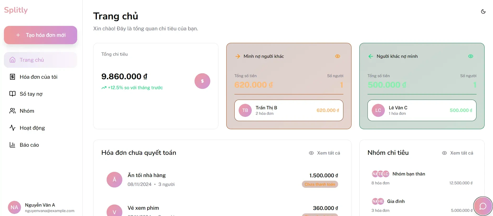

### Screen C02 — Create Bill / Manual Entry

**Purpose:** Establish the current workflow as manual.

Required elements:

- Title: Create New Bill.
- Subtitle or helper text indicating manual information entry.
- General-information section.

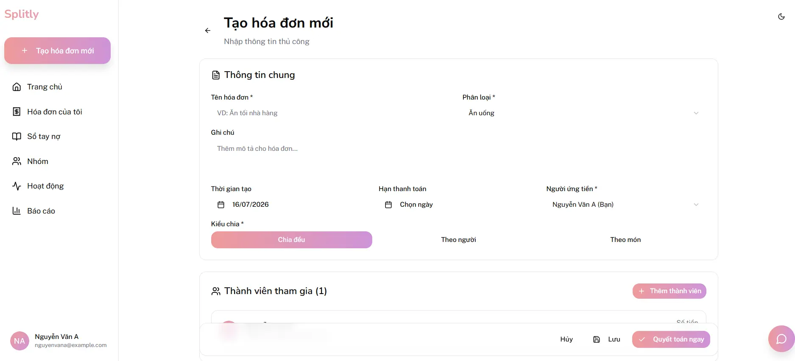

### Screen C03 — General Information

Required fields:

- bill name;
- category;
- notes;
- date;
- payment deadline;
- payer;
- total amount;
- split method.

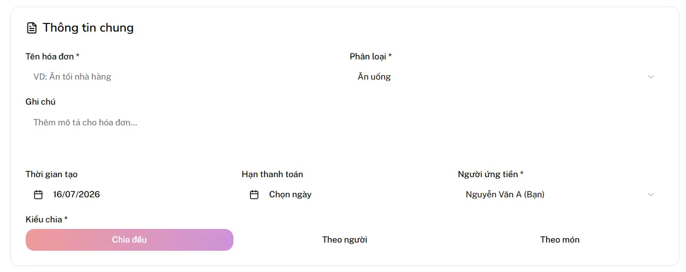

### Screen C04 — Select Payer

Required elements:

- participant list;
- selected state;
- one-payer constraint;
- confirm action.

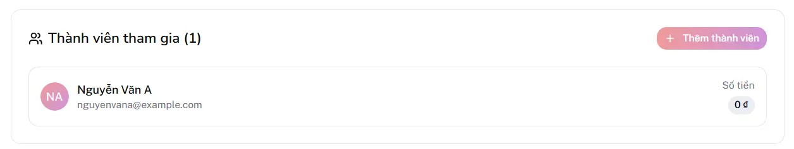

### Screen C05 — Add Participants

Required elements:

- search;
- friend/group results;
- selected participants;
- add/confirm action.

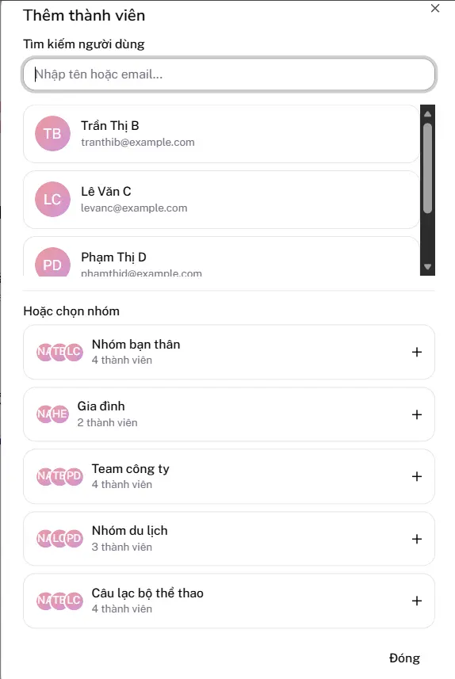

### Screen C06 — Select Split Type

Show:

- equal;
- by person;
- by item.

The main prototype path should choose **by item** because it best demonstrates the practical fairness problem.

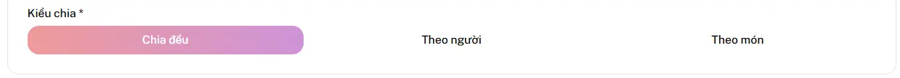

### Screen C07 — Manual Item Entry

Show a realistic receipt with at least:

- one individual item;
- one item shared by two participants;
- one item shared by the full group;
- quantity and price fields.

Suggested sample:

| Item          | Quantity |      Amount |
| ------------- | -------: | ----------: |
| Beef noodles  |        2 | 140,000 VND |
| Fried rice    |        1 |  75,000 VND |
| Shared hotpot |        1 | 420,000 VND |
| Soft drinks   |        5 | 125,000 VND |

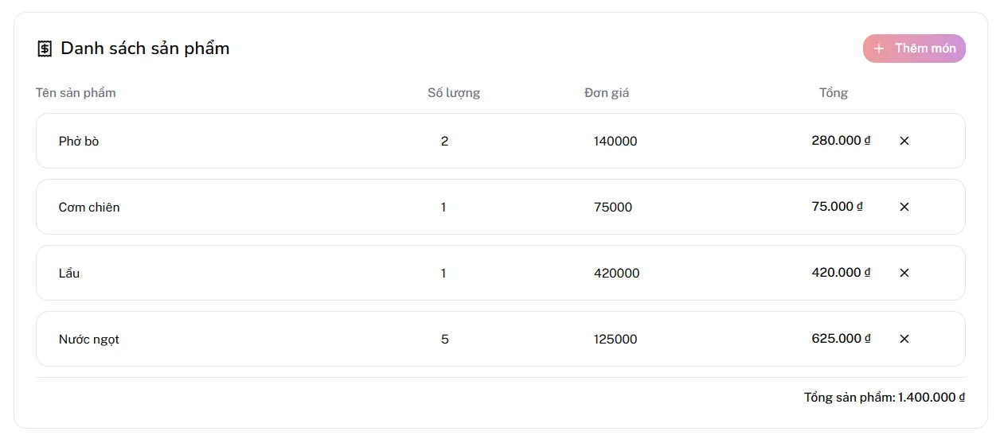

### Screen C08 — Item Assignment

Required elements:

- participant avatars or names;
- multiple selection for shared items;
- participant subtotal preview.

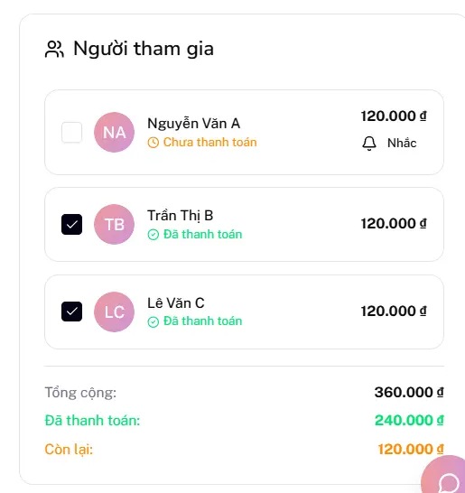

### Screen C09 — Validation

Show either:

- valid total confirmation; or
- mismatch error followed by correction.

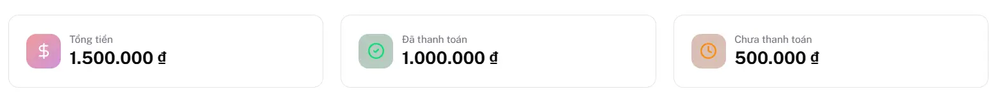

### Screen C10 — Saved Bill Detail

Required elements:

- bill title;
- payer;
- confirmed total;
- participant amounts;
- paid/unpaid statuses;
- progress indicator.

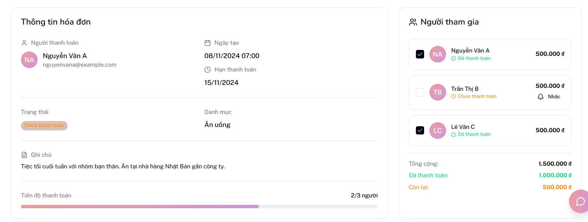

### Screen C11 — Payment Tracking

Show:

- one participant paid;
- one participant unpaid;
- reminder action;
- overall progress.

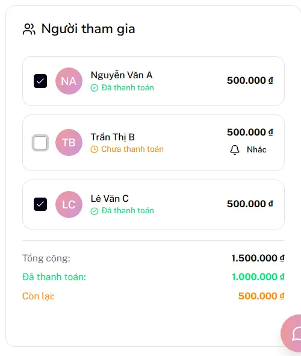

---

## 4. Future-State Prototype Flow

```mermaid
flowchart LR
    F01[Future 01 Entry Method] --> F02[Future 02 Upload Receipt]
    F02 --> F03[Future 03 Receipt Preview]
    F03 --> F04[Future 04 AI Processing]
    F04 --> F05[Future 05 AI Review]
    F05 --> F06[Future 06 Correct Warning]
    F06 --> F07[Future 07 Select Payer and Participants]
    F07 --> F08[Future 08 Assign Items]
    F08 --> F09[Future 09 Validate and Save]
    F09 --> F10[Future 10 Bill Detail]
```

### Screen F01 — Entry Method Selection

Required options:

- Scan receipt with AI.
- Enter manually.

Recommended supporting text:

> Scan a receipt to pre-fill the bill. You will review the result before saving.

### Screen F02 — Receipt Upload

Required elements:

- upload zone;
- camera action;
- supported formats;
- image-quality tips;
- manual-entry link.

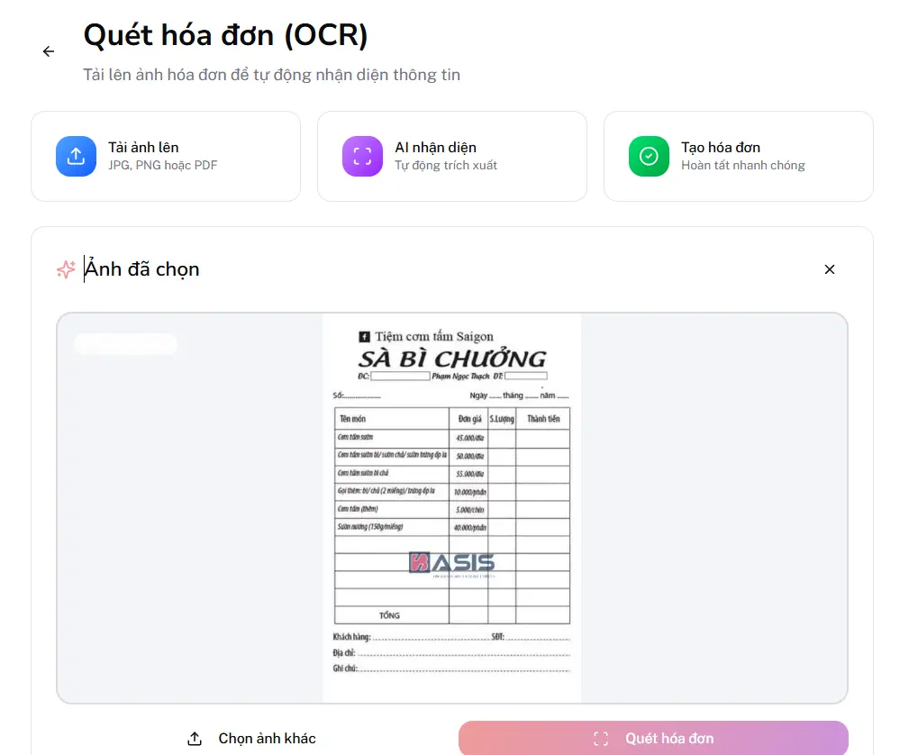

### Screen F03 — Receipt Preview

Required elements:

- image preview;
- replace;
- remove;
- scan action;
- privacy note if approved.

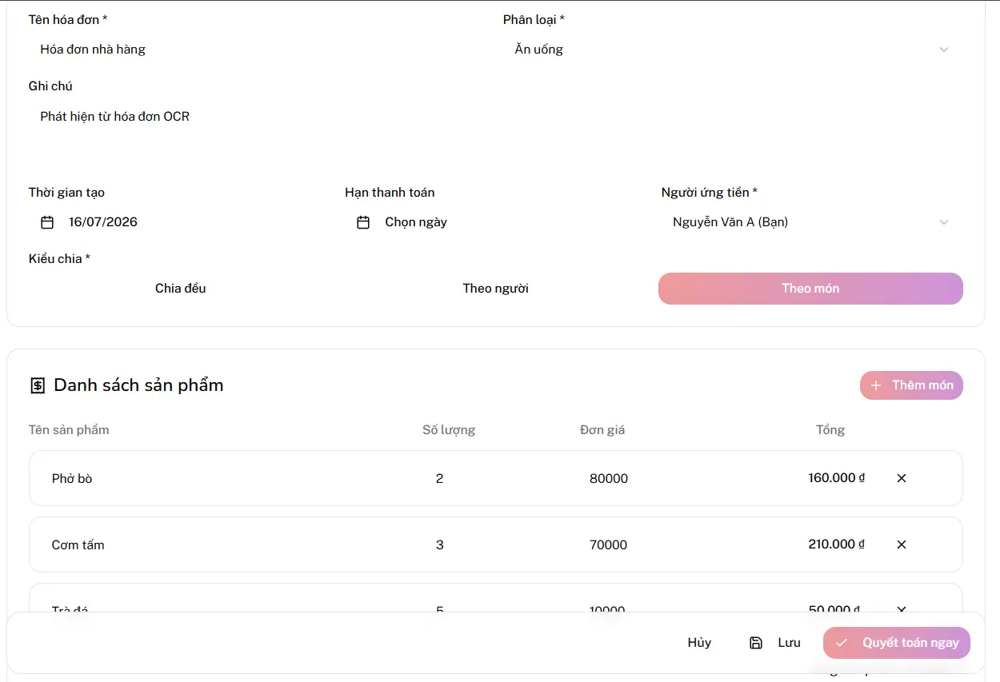

### Screen F04 — AI Processing

Required elements:

- progress state;
- explanation;
- no misleading guarantee of accuracy.

Suggested message:

> Reading the receipt and preparing an editable draft…

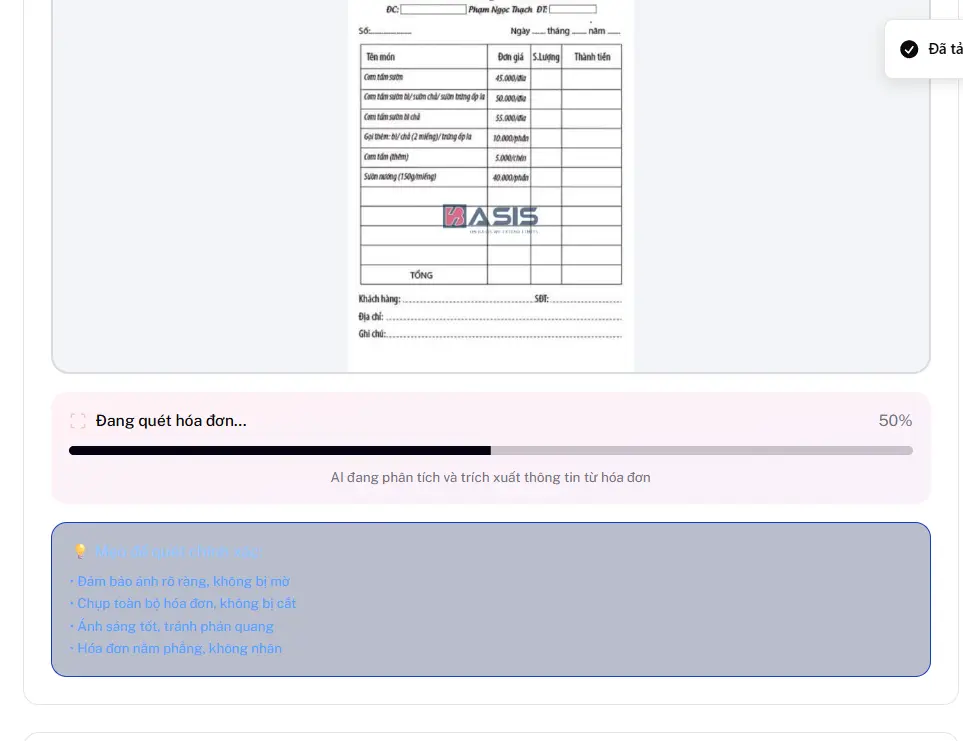

### Screen F05 — AI-Prefilled Review

Required elements:

- extracted bill title or merchant;
- extracted date;
- total amount;
- line items;
- editable fields;
- receipt thumbnail;
- continue action.

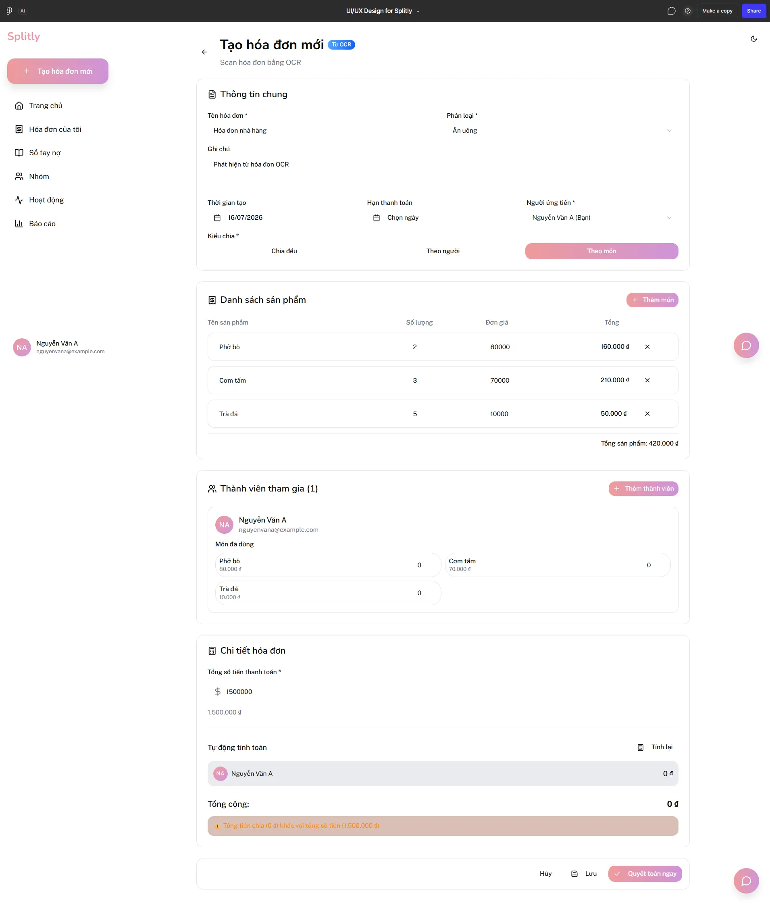

### Screen F06 — Warning and Correction

Include at least one example:

- unreadable item name;
- uncertain price;
- missing quantity;
- derived-total mismatch.

Suggested visual states:

- amber outline for uncertain;
- error icon for required correction;
- receipt-side reference.

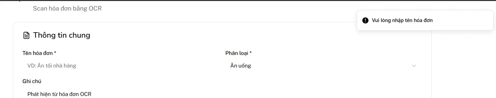

### Screen F07 — Payer and Participants

Reuse current components.

The prototype should visually communicate that AI only enters receipt data; the user still decides:

- who paid;
- who participated;
- how to split.

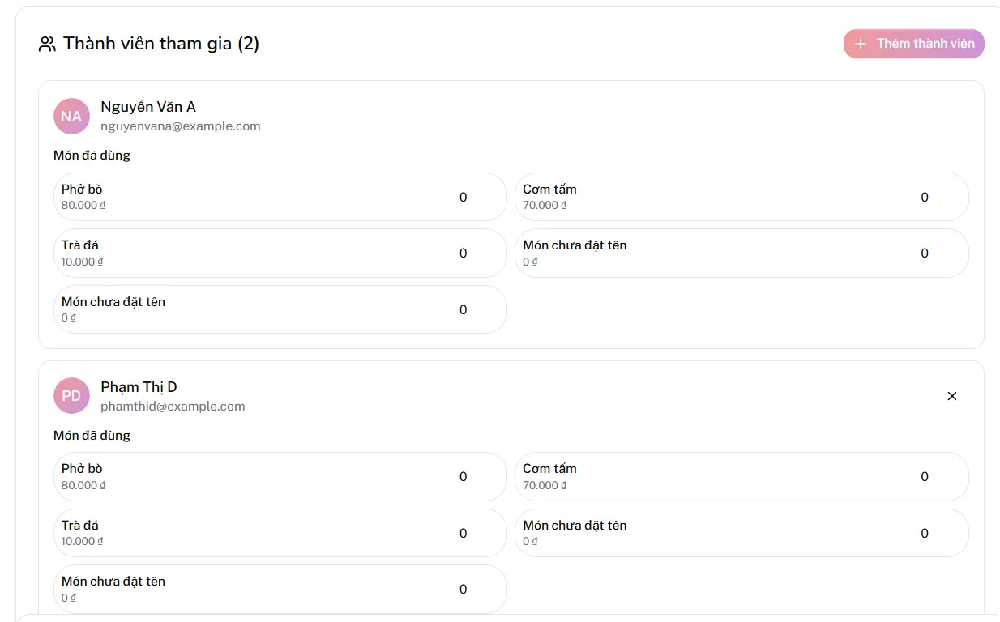

### Screen F08 — Item Assignment

Show extracted items already present. The user only assigns them.

This is the key visual comparison with the current workflow:

- current: type item, price, and quantity;
- future: review extracted item, then assign participants.

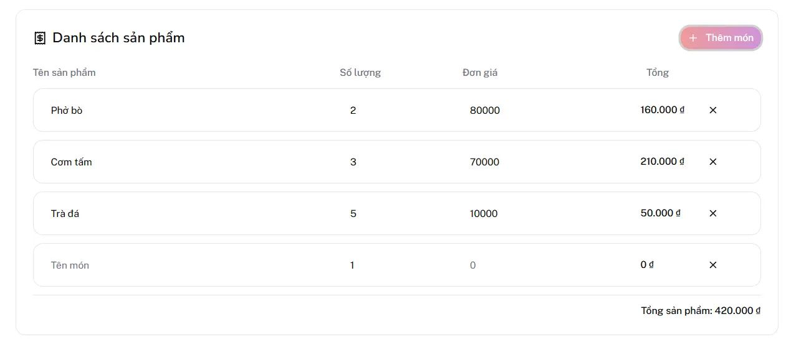

### Screen F09 — Validate and Save

Required elements:

- confirmed receipt total;
- allocated total;
- difference;
- unresolved-warning count;
- save action enabled only when valid.

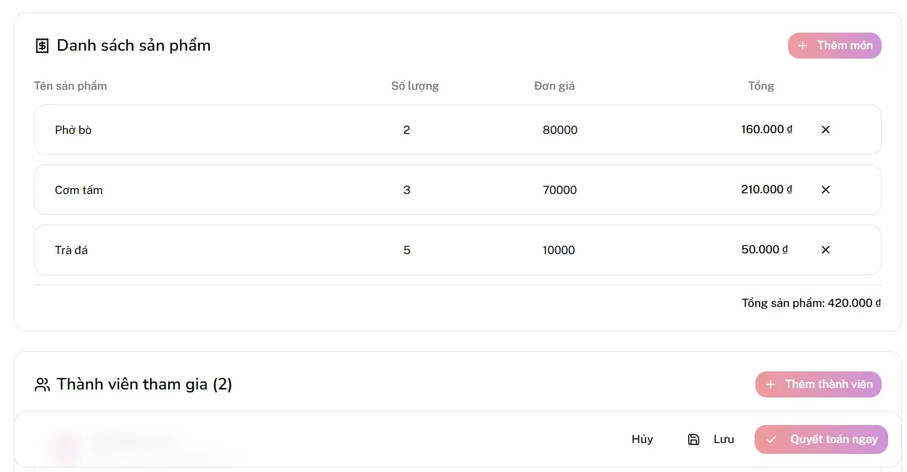

### Screen F10 — Bill Detail

Reuse the current bill-detail view.

Optional future indicator:

- “Created from receipt scan” badge;
- receipt thumbnail or source reference.

Do not add the badge unless TV4 and TV5 confirm it as a requirement.

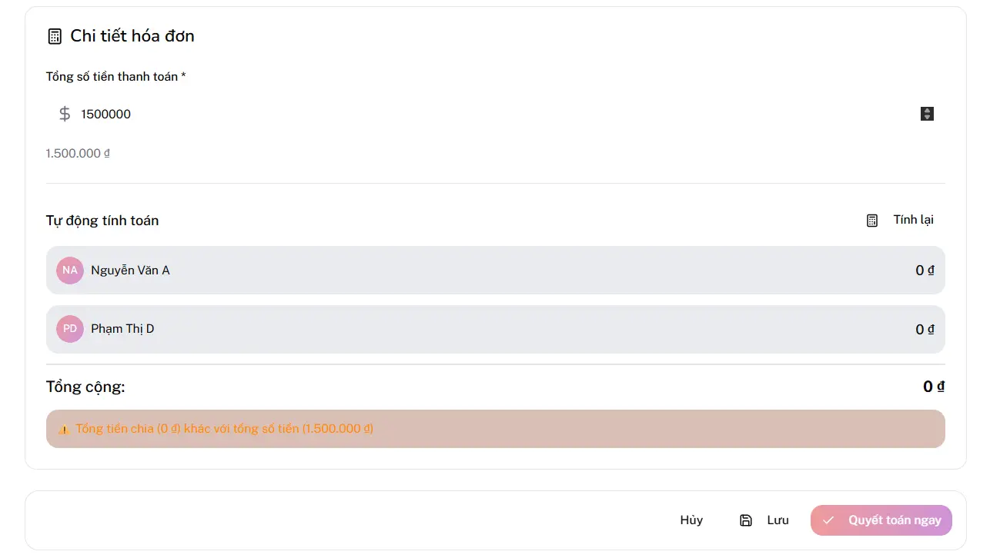
