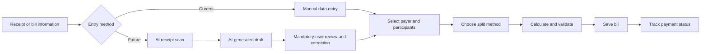

# Splitly — Project Vision and Scope

## 1. Document Purpose

This document defines the product vision, target users, current-state scope, future-state scope, product boundaries, assumptions, and expected outcomes for Splitly.

The document intentionally separates the current manual-entry workflow from the future AI-assisted receipt-scanning workflow. OCR-related code in the repository is treated as an experimental foundation rather than a completed current-state capability.

---

## 2. Product Overview

Splitly is a responsive expense-sharing web application that helps a group record a shared bill, determine how much each participant owes, and track whether each participant has paid.

The current application supports manual bill creation with three splitting approaches:

1. **Equal split** — the bill is divided equally among selected participants.
2. **By-person split** — the creator specifies the exact amount owed by each participant.
3. **By-item split** — bill items are entered manually and assigned to one or more participants.

After a bill is created, the application provides a bill-detail view with participant-level amounts, payment progress, payment status, and reminder actions.

The future product state will add an AI-assisted receipt-scanning workflow that extracts bill data from a receipt image and pre-fills the existing bill-creation form. The user must review and confirm the extracted data before the bill is saved.

---

## 3. Product Vision

> **To make shared dining expenses quick, fair, and transparent by reducing manual bill transcription while preserving user control over how every item and payment is allocated.**

Splitly is not positioned as a simple calculator that only divides a total by the number of participants. Its value comes from combining:

- structured bill records;
- flexible splitting methods;
- item-to-person allocation;
- payment tracking;
- a future AI-assisted data-entry flow;
- a mandatory human review step for financial accuracy.

---

## 4. Mission Statement

> **Splitly enables groups to transform a physical receipt into a clear, reviewable, and trackable shared expense record, reducing calculation effort, payment confusion, and awkward follow-up conversations.**

---

## 5. Product Positioning

### 5.1 Current Position

The current version is a **manual shared-bill management tool**.

Users enter bill details, select a payer and participants, choose a splitting method, save the bill, and track payment completion.

### 5.2 Future Position

The future version is an **AI-assisted shared-bill management tool**.

Users scan or upload a receipt, AI extracts structured data, the system pre-fills the bill form, and the user verifies the result before continuing with participant assignment and splitting.

### 5.3 Positioning Statement

For groups of friends who frequently share meals, coffee, and entertainment expenses, Splitly is a bill-sharing application that provides flexible allocation and payment tracking. Unlike using a calculator, notes application, or group chat, Splitly keeps bill data, participant obligations, and payment status in one structured workflow. Its future AI-assisted scanning feature will reduce repetitive manual entry without removing user review and control.

---

## 6. Problem Statement

### 6.1 Primary Problem

When a group shares a restaurant or café bill, one person commonly has to:

- read the receipt;
- manually enter or recalculate the bill;
- identify which participant consumed each item;
- divide shared items;
- communicate each person's amount;
- remember who has already paid;
- remind unpaid participants.

Even when the arithmetic is simple, the full process is repetitive, error-prone, and socially inconvenient.

### 6.2 Current-State Pain Points

| Pain point | Consequence |
|---|---|
| Manual transcription of bill information | Slow bill creation and risk of input errors |
| Re-entering every item for item-based splitting | High effort for long receipts |
| Switching between receipt, calculator, notes, and chat | Fragmented workflow |
| Unclear payment status | Repeated checking and follow-up |
| Manual reminders | Social discomfort for the payer |
| Lack of a shared record | Disagreement about amounts or payment status |

### 6.3 Future-State Opportunity

AI-assisted receipt scanning can reduce the most repetitive step: converting an unstructured receipt image into structured bill data.

The AI feature does not replace the user. It produces a draft that must be reviewed because receipt images may be blurred, incomplete, folded, or formatted inconsistently.

---

## 7. Target Users

### 7.1 Primary Persona — Social Dining Group

**Persona name:** Minh — Group Bill Organizer  
**Segment:** Friends or young professionals sharing meals, coffee, and entertainment expenses  
**Typical age range:** 18–35  
**Role in the workflow:** The person who pays upfront or volunteers to create the bill

#### Characteristics

- Frequently joins meals, cafés, parties, movies, or entertainment activities with friends.
- Usually uses a smartphone during or immediately after the activity.
- Wants to complete the bill split quickly before the group disperses.
- May need equal, by-person, or item-based splitting depending on the situation.
- Wants a clear record of who owes what and who has paid.

#### Goals

- Create a shared bill with minimal effort.
- Allocate costs fairly.
- Avoid manual recalculation.
- Avoid sending repeated individual messages.
- Confirm that the collected amount matches the bill.

#### Frustrations

- Long receipts with many items.
- Shared items consumed by multiple people.
- Participants leaving before the split is complete.
- Needing to check bank transfers manually.
- OCR errors that are difficult to notice.

<!-- FIGMA SCREENSHOT REQUIRED: Primary persona card or user-profile slide from the Figma Make prototype, if available -->

### 7.2 Secondary Persona — Travel Group Organizer

A person coordinating food, transport, accommodation, and activity expenses during a group trip.

Key additional needs include rapid entry of many bills and a clear history. Multi-currency and final trip-wide settlement are not included in the approved TV3 scope unless separately approved by the team.

### 7.3 Secondary Persona — Roommate Expense Coordinator

A roommate recording shared groceries, household supplies, utilities, or occasional shared purchases.

Recurring billing is not part of the approved current/future workflow in this document.

---

## 8. Product Goals

### 8.1 Current-State Goals

- Provide a clear manual workflow for creating a bill.
- Support equal, by-person, and by-item splitting.
- Allow a bill item to be assigned to one or more participants.
- Record one designated payer for each bill.
- Display each participant's amount and payment status.
- Preserve bill history for later review.

### 8.2 Future-State Goals

- Allow users to upload or capture a receipt.
- Use AI to extract structured bill information.
- Pre-fill the existing bill-creation form.
- Make uncertain or missing data visible to the user.
- Require user review before saving.
- Preserve manual correction and manual-entry fallback.
- Reduce bill-creation effort without weakening financial accuracy.

---

## 9. Current-State Scope

The current state is the manual bill-entry workflow that the team considers stable enough to demonstrate.

### 9.1 In Scope

- User authentication and protected access.
- Manual bill creation.
- Bill name.
- Category.
- Notes.
- Creation date.
- Payment deadline.
- One designated payer.
- Participant selection.
- Equal split.
- By-person split.
- By-item split.
- Item quantity and amount entry.
- Assignment of an item to one or more participants.
- Calculation and validation of participant amounts.
- Bill saving.
- Bill history and detail.
- Participant payment status.
- Payment progress.
- Payment reminders.

### 9.2 Current-State Limitations

- Bill data must be typed manually.
- Only one payer is stored for a bill.
- OCR is not accepted as a completed current-state feature.
- Explicit tax, service fee, tip, and discount fields are not confirmed in the current manual form.
- The repository documentation contains broader feature claims than the verified current workflow.
- AI payer selection, group-wide settlement optimization, recurring bills, and multi-currency are not part of the current state.

---

## 10. Future-State Scope

The approved future state focuses on AI receipt scanning and automatic bill-form population.

### 10.1 In Scope

- Capture or upload a receipt image.
- Supported image validation.
- Receipt preview.
- AI/OCR processing state.
- Extraction of available receipt fields:
  - merchant or bill title;
  - transaction date;
  - total amount;
  - item names;
  - item quantities where available;
  - item prices;
  - category suggestion where feasible.
- Pre-filling the manual bill-entry form.
- User review and correction of extracted information.
- Selection of payer and participants.
- Selection of split method.
- Item assignment.
- Total and allocation validation.
- Saving the confirmed bill.
- Payment tracking after creation.
- Manual-entry fallback.
- Error message and retry flow.

### 10.2 Conditionally In Scope

The following fields may be included only when TV4 and TV5 confirm requirements and feasibility:

- tax;
- service charge;
- tip;
- discount or voucher;
- OCR confidence indicator;
- field-level warning state;
- receipt image retention policy.

### 10.3 Out of Scope for This Future-State Definition

- Fully autonomous saving without human review.
- Automatic bank transfer initiation.
- Multiple payers for a single bill.
- Cross-bill debt simplification.
- AI payer rotation.
- Group fund or wallet.
- Multi-currency conversion.
- Recurring bills.
- Advanced analytics.
- Dispute-resolution workflow.
- Native mobile application.
- Automatic interpretation of handwritten receipts unless separately validated.

---

## 11. Scope Boundary Diagram

---

## 12. Assumptions

- The primary use case involves a single receipt for one social dining event.
- A single user creates the bill.
- One person is designated as the payer in the current data model.
- Participants are identifiable through existing users or supported participant-selection mechanisms.
- The user has access to the physical or digital receipt.
- AI output is treated as a draft, not as authoritative financial data.
- The user is responsible for confirming the final total and allocation.
- Manual bill creation remains available after OCR is introduced.

---

## 13. Constraints

- Receipt quality varies significantly.
- Vietnamese receipt layouts are not standardized.
- Item names may be abbreviated.
- Totals may include tax, service charges, discounts, or rounding that are not represented as normal items.
- OCR/AI provider cost or usage limits may restrict testing.
- The current UI and data model may require changes to represent extraction confidence and receipt metadata.
- Financial calculations require deterministic validation independent of AI output.
- The future workflow must fit the team's approved schedule and available technical resources.