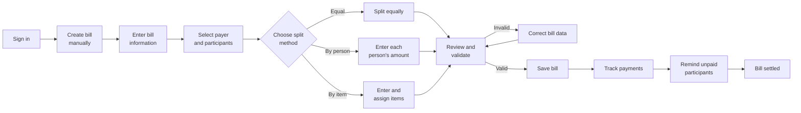
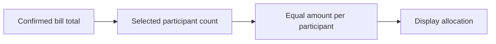
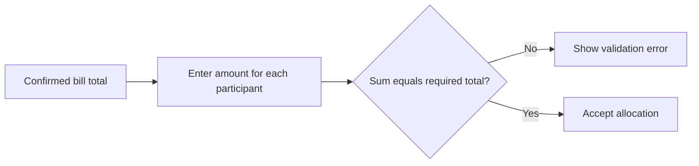
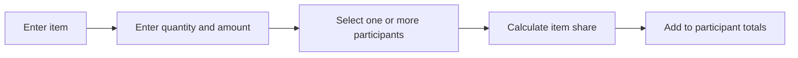

# Splitly — Current-State Workflow

## 1. Workflow Definition

The current state is the workflow that the team considers implemented and demonstrable: **manual bill entry followed by bill splitting and payment tracking**.

Although the repository contains an OCR page and OCR-related documentation, OCR is excluded from the current baseline because the team has not accepted it as sufficiently reliable.

---

## 2. Primary Current-State Scenario

A group of friends finishes a meal. One member has paid the restaurant bill and creates a bill in Splitly so that every participant can see their assigned amount and payment status.

---

## 3. Current-State End-to-End Workflow

<!-- FIGMA SCREENSHOT REQUIRED: Current-state flow overview or the first current-state screen from Figma Make -->

---

## 4. Detailed Workflow Specification

| Step   | Actor                 | Action                                                                                                                                                                                                                                                               | System response                                        | Current issue                                                       |
| ------ | --------------------- | -------------------------------------------------------------------------------------------------------------------------------------------------------------------------------------------------------------------------------------------------------------------- | ------------------------------------------------------ | ------------------------------------------------------------------- |
| CS-01  | User                  | 1. Opens the Splitly sign-in page. 2. Enters login credentials. 3. Submits the sign-in form.                                                                                                                                                                   | Opens protected application area                       | Authentication is a prerequisite rather than part of bill splitting |
| CS-02  | Bill creator          | 1. Opens the Dashboard. 2. Selects **Create Bill**. 3. Chooses the manual bill-entry option.                                                                                                                                                                   | Displays manual bill-entry page                        | User must start from a blank form                                   |
| CS-03  | Bill creator          | 1. Enters the bill name. 2. Selects a category. 3. Adds optional notes. 4. Selects the bill date and payment deadline. 5. Enters the total bill amount.                                                                                                  | Stores bill name, category, notes, dates               | Repetitive information may be typed every time                      |
| CS-04  | Bill creator          | 1. Opens the payer-selection interface. 2. Searches for or selects a group member. 3. Confirms that member as the payer.                                                                                                                                       | Stores one designated payer                            | Multiple payers are not supported in the current payload            |
| CS-05  | Bill creator          | 1. Opens the participant-selection interface. 2. Searches for group members. 3. Selects the people included in the bill. 4. Reviews and confirms the participant list.                                                                                      | Displays selected participants                         | Participant search and selection add interaction cost               |
| CS-06  | Bill creator          | 1. Reviews the available splitting methods. 2. Chooses **Equal**, **By person**, or **By item**. 3. Opens the corresponding split interface.                                                                                                                   | Displays the relevant split interface                  | User must decide the correct method                                 |
| CS-07A | System                | 1. Reads the confirmed bill total. 2. Counts the selected participants. 3. Divides the total equally among them. 4. Handles any rounding difference. 5. Displays each participant’s amount.                                                              | Shows equal participant amounts                        | May be unfair when consumption differs                              |
| CS-07B | Bill creator          | 1. Reviews the selected participants. 2. Enters the exact amount owed by each person. 3. Adjusts individual amounts when necessary. 4. Confirms the entered distribution.                                                                                   | Validates specified amounts                            | Creator must calculate values externally or mentally                |
| CS-07C | Bill creator          | 1. Reads each item from the physical bill. 2. Creates an item row. 3. Enters the item name. 4. Enters its quantity and price. 5. Repeats the process until all items are recorded.                                                                       | Creates structured item rows                           | Main current bottleneck for long receipts                           |
| CS-08  | Bill creator          | 1. Selects a bill item. 2. Chooses one or more participants who consumed it. 3. Confirms whether the item is individual or shared. 4. Repeats the assignment for all items. 5. Reviews each participant’s subtotal.                                      | Calculates each participant's share                    | Allocation still requires human knowledge                           |
| CS-09  | System                | 1. Checks that all required fields are completed. 2. Verifies that a payer and participants are selected. 3. Validates item and participant amounts. 4. Compares the allocated total with the bill total. 5. Displays errors or enables bill submission. | Displays error or permits save                         | Validation rules must be synchronized with TV4                      |
| CS-10  | Bill creator          | 1. Reviews the final bill summary. 2. Corrects any remaining errors. 3. Selects **Save Bill**. 4. Confirms bill creation.                                                                                                                                   | Creates bill record and navigates to history           | Incorrect manual transcription becomes persistent                   |
| CS-11  | User                  | 1. Opens Bill History or the related group page. 2. Selects the saved bill. 3. Reviews the payer, participants, total amount, individual amounts, and payment progress.                                                                                        | Shows payer, participant amounts, and payment progress | The record is useful only if original input was correct             |
| CS-12  | Participant / creator | 1. Reviews the amount that must be paid. 2. Completes the payment outside or through the supported payment flow. 3. Records or confirms the payment in Splitly. 4. Reviews the updated payment status.                                                      | Updates payment state                                  | Actual bank transfer and in-app status may differ                   |
| CS-13  | Creator               | 1. Opens the list of unpaid participants. 2. Selects a participant who has not paid. 3. Sends a payment reminder. 4. Repeats the action when necessary. 5. Monitors the bill until all payments are completed.                                           | Notifies unpaid participant                            | Reminder is still socially sensitive but more structured            |

---

## 5. Current-State Input Model

The manual bill workflow requires or supports the following user-entered information:

### General Information

- bill name;
- category;
- notes;
- creation date;
- payment deadline;
- one payer;
- total amount;
- splitting method.

### Participants

- participant selection;
- participant removal;
- exact amount per participant for by-person split.

### Items for By-Item Split

- item name;
- item amount;
- quantity;
- one or more assigned participants.

---

## 6. Current Splitting Methods

### 6.1 Equal Split

Best for situations where all participants agree to divide the bill equally.

### 6.2 By-Person Split

Best when the creator already knows the exact amount owed by each participant.

### 6.3 By-Item Split

Best when participants consumed different items or shared specific items.

<!-- FIGMA SCREENSHOT REQUIRED: Current manual bill-entry page showing split-type controls -->

<!-- FIGMA SCREENSHOT REQUIRED: Current by-item allocation screen showing an item assigned to multiple participants -->

---

## 7. Current-State Pain-Point Analysis

### 7.1 Manual Data Entry Is the Main Bottleneck

The user must repeatedly move attention between the physical receipt and the form. Long receipts increase the chance of:

- skipped items;
- incorrect prices;
- incorrect quantities;
- duplicated items;
- incorrect total;
- incorrect participant assignment.

### 7.2 Flexible Splitting Does Not Remove Transcription Effort

The current system improves organization after data has been entered, but it does not reduce the effort needed to convert the receipt into structured item data.

### 7.3 By-Person Split Can Shift Calculation Outside the Product

When the user selects by-person split, the exact amounts may need to be calculated before being entered. This can lead users back to calculators, notes, or spreadsheets.

### 7.4 One-Payer Constraint

The current bill payload uses one `payerId`. A real event where two people paid different parts of a bill cannot be accurately represented without an agreed workaround.

### 7.5 Documentation and Implementation Are Not Fully Aligned

The repository documents describe tax/discount adjustment and OCR as product features, but the accepted current state is manual entry and the verified bill form does not clearly expose dedicated tax/discount fields.

This discrepancy must be resolved through cross-checking rather than hidden in the final submission.

---

## 8. Current-State Screens to Show in the Prototype

1. Login or authenticated dashboard entry.
2. Create Bill entry point.
3. Manual bill general-information form.
4. Payer selection dialog.
5. Participant selection dialog.
6. Split-type selection.
7. Equal split result.
8. By-person amount entry.
9. By-item item entry and participant allocation.
10. Validation error state.
11. Saved bill detail.
12. Payment progress and participant status.
13. Reminder action.

<!-- FIGMA SCREENSHOT REQUIRED: Dashboard/Create Bill entry point -->

<!-- FIGMA SCREENSHOT REQUIRED: Payer and participant selection views -->

<!-- FIGMA SCREENSHOT REQUIRED: Bill detail showing payment progress -->

---

## 9. Current-State Outcome

The current workflow provides a structured record and payment-tracking process, but bill creation remains time-consuming because the receipt must be typed manually.

This limitation creates the justification for the future AI-assisted workflow.
