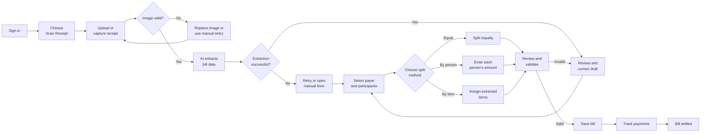
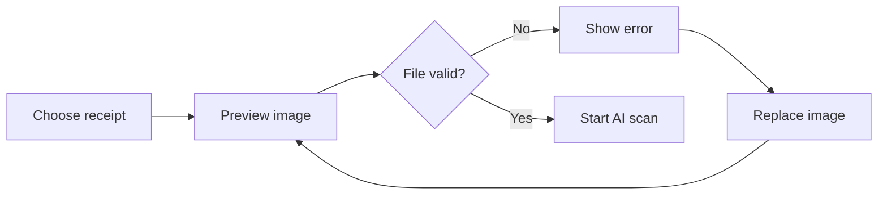
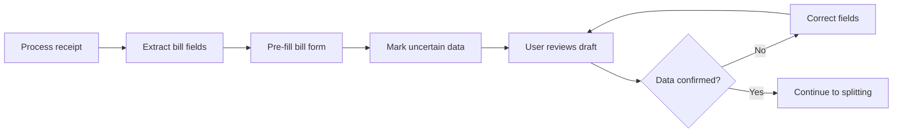
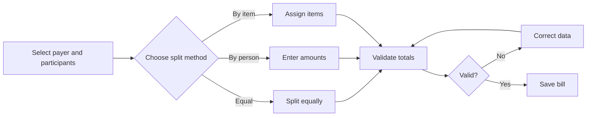

# Splitly — Future-State Workflow

## 1. Workflow Definition

The future state is the proposed Gemini-assisted workflow: **receipt scanning and automatic bill-form population followed by user review, bill splitting, and payment tracking**. It is a target design for the new build, not an already operating feature.

The user uploads or captures a receipt image. Gemini 2.5 Flash extracts available bill information and creates an editable draft. The user must review and correct the extracted data before the bill can be saved.

Manual bill entry remains available as a fallback when the receipt is unsupported, the image quality is poor, or AI processing fails.

---

## 2. Primary Future-State Scenario

A group of friends finishes a meal. One member has paid the restaurant bill and uploads a receipt image to Splitly.

Gemini 2.5 Flash extracts the bill title, date, total amount, and line items. The bill creator reviews the extracted information, corrects uncertain fields, selects the payer and participants, assigns items, and saves the confirmed bill.

Every participant can then view their assigned amount and payment status.

---

## 3. Future-State End-to-End Workflow

---

## 4. Detailed Workflow Specification

| Step | Actor | Action | System response | Future consideration |
|---|---|---|---|---|
| FS-01 | User | 1. Opens the Splitly sign-in page. 2. Enters login credentials. 3. Submits the sign-in form. | Opens the protected application area. | Authentication remains a prerequisite rather than part of receipt processing. |
| FS-02 | Bill creator | 1. Opens the Dashboard or Create Bill page. 2. Selects **Scan Receipt** as the bill-entry method. 3. Reviews the scanning instructions. | Displays the receipt-upload interface. | Manual entry must remain visible as an alternative. |
| FS-03 | Bill creator | 1. Selects an image from the device or captures a new photo. 2. Ensures that the full receipt is visible. 3. Confirms the selected image. | Displays the receipt preview. | Camera support may vary between browsers and devices. |
| FS-04 | System | 1. Accepts JPG/JPEG, PNG, or WebP. 2. Rejects files larger than 10 MB. 3. Verifies that the uploaded file can be processed as an image. 4. Displays an error when validation fails. | Accepts the image or requests a replacement. | PDF receipt input is deferred to the post-MVP backlog. |
| FS-05 | Bill creator | 1. Reviews the receipt preview. 2. Replaces or removes the image when necessary. 3. Selects **Scan** or **Process Receipt**. | Sends the confirmed image for AI processing. | The interface should warn users about blur, glare, cropping, and unreadable text. |
| FS-06 | System / Gemini 2.5 Flash | 1. Receives the receipt image. 2. Interprets receipt text and layout. 3. Identifies available bill fields. 4. Extracts line items and amounts. 5. Returns a structured draft. | Produces extracted bill information or an error result. | The provider adapter must enforce the approved response schema, timeout, error, and privacy contract. |
| FS-07 | System | 1. Maps the AI response to the Splitly bill form. 2. Pre-fills supported fields. 3. Creates item rows from extracted line items. 4. Marks missing or uncertain information. | Displays an editable AI-generated bill draft. | Use the receipt-draft fields and validation rules defined by AC-18 to AC-21. |
| FS-08 | Bill creator | 1. Compares the extracted data with the receipt image. 2. Corrects the bill title, date, total, item names, quantities, and prices. 3. Adds missing items. 4. Removes duplicated or incorrect items. 5. Confirms the corrected receipt data. | Updates the draft and clears resolved warnings. | AI output must never be treated as final financial data without review. |
| FS-09 | Bill creator | 1. Opens the payer-selection interface. 2. Selects one group member as the payer. 3. Opens the participant-selection interface. 4. Adds all people included in the bill. 5. Confirms the payer and participant list. | Stores one designated payer and the selected participants. | Multiple payers are post-MVP. |
| FS-10 | Bill creator | 1. Reviews the available splitting methods. 2. Chooses **Equal**, **By person**, or **By item**. 3. Opens the corresponding split interface. | Displays the relevant splitting interface. | By-item splitting is the recommended main prototype path for the primary persona. |
| FS-11A | System | 1. Reads the confirmed bill total. 2. Counts the selected participants. 3. Divides the amount equally. 4. Handles any approved rounding rule. 5. Displays each participant's amount. | Shows the equal allocation. | Equal splitting may still be unfair when consumption differs. |
| FS-11B | Bill creator | 1. Reviews the selected participants. 2. Enters the exact amount owed by each person. 3. Adjusts individual amounts when necessary. 4. Confirms the entered distribution. | Validates the specified participant amounts. | The creator may still need external knowledge to determine exact amounts. |
| FS-11C | Bill creator | 1. Reviews the AI-extracted item list. 2. Corrects any remaining item information. 3. Selects one or more participants for each item. 4. Confirms individual and shared items. 5. Reviews participant subtotals. | Calculates each participant's item-based share. | AI reduces transcription but cannot determine who consumed each item without user input. |
| FS-12 | System | 1. Checks that all required fields are completed. 2. Verifies the payer and participant list. 3. Checks unresolved AI warnings. 4. Validates item and participant amounts. 5. Compares the allocated total with the confirmed bill total. 6. Displays errors or enables bill submission. | Shows validation feedback or permits saving. | Server-side calculation and deterministic rounding must keep the allocated sum equal to the confirmed total. |
| FS-13 | Bill creator | 1. Reviews the final bill summary. 2. Corrects any remaining validation errors. 3. Selects **Save Bill**. 4. Confirms bill creation. | Creates the confirmed bill record and opens history or bill detail. | The system should not save directly from raw AI output. |
| FS-14 | User | 1. Opens the saved bill. 2. Reviews the payer, participants, total, individual amounts, and payment progress. | Displays the confirmed bill detail. | The raw receipt image is processed transiently; only user-confirmed structured data is saved. |
| FS-15 | Participant / creator | 1. Reviews the amount that must be paid. 2. Completes the payment outside or through the supported payment flow. 3. Records or confirms the payment in Splitly. 4. Reviews the updated status. | Updates the participant's payment status. | Actual bank-transfer status and in-app status may still differ. |
| FS-16 | Creator | 1. Opens the list of unpaid participants. 2. Selects an unpaid participant. 3. Sends a reminder. 4. Monitors payment progress. 5. Repeats the action until all required payments are complete. | Notifies unpaid participants and updates overall progress. | Reminder behavior should remain consistent with the current workflow. |

---

## 5. Future-State Input Model

The AI-assisted workflow requires or supports the following information.

### Receipt Input

- JPG/JPEG, PNG, or WebP receipt image, maximum 10 MB;
- image file type;
- image file size;
- image preview;
- image-quality status;
- upload or capture source.

### AI-Extracted Draft

- merchant or bill name;
- transaction date;
- total amount;
- item names;
- item quantities where available;
- item prices;
- tax, service charge, discount, or tip when supported;
- category suggestion where supported;
- missing-field indicators;
- uncertain-field indicators.

### User-Confirmed Information

- corrected bill information;
- corrected line items;
- one payer;
- selected participants;
- splitting method;
- item-to-participant assignments;
- final participant amounts;
- confirmed bill total.

---

## 6. Future AI-Assisted Processing Stages

### 6.1 Receipt Upload and Validation

The user uploads or captures a receipt. The system verifies that the file is supported before AI processing begins.

### 6.2 AI Extraction and User Review

AI converts the receipt image into an editable bill draft. The user compares the draft with the original receipt and corrects any errors.

### 6.3 Split, Validate, and Save

After the bill data is confirmed, the user selects participants and completes the same controlled splitting workflow used in the current state.

---

## 7. Future-State Risk and Limitation Analysis

### 7.1 AI Extraction May Be Inaccurate

Receipt layouts are inconsistent. Images may contain blur, glare, folds, shadows, or cropped text.

AI may incorrectly extract:

- item names;
- quantities;
- prices;
- total amount;
- tax;
- service charges;
- discounts.

For this reason, every AI-generated bill must remain editable and require user confirmation.

### 7.2 AI Cannot Determine Consumption

AI can identify receipt items, but it normally cannot know which participant consumed each item.

The bill creator must still assign individual and shared items.

### 7.3 Special Charges May Cause Total Mismatch

Tax, service charge, tip, discount, and rounding may not appear as normal line items.

The system must identify or allow manual correction of these values before the allocated total can be validated.

### 7.4 AI Service Dependency

The future workflow depends on the external Gemini 2.5 Flash API.

Potential issues include:

- API downtime;
- slow processing;
- usage limits;
- provider cost;
- response-format changes;
- privacy concerns.

A retry path and manual-entry fallback are required.

### 7.5 Receipt Privacy

Receipt images may expose:

- merchant information;
- location;
- transaction time;
- payment references;
- personal spending behavior.

The MVP processes receipt images transiently and stores only user-confirmed structured bill data. Provider-side retention remains subject to the selected Gemini terms and must be disclosed.

### 7.6 Proposed MVP Data-Model Constraints Remain

AI receipt scanning improves data entry, but it does not automatically solve:

- multiple payers;
- cross-bill debt settlement;
- recurring bills;
- multi-currency;
- automatic bank-transfer confirmation.

These functions remain outside the approved future-state workflow.

---

## 8. Prototype Reference

The screen-level design and visual representation of the future-state workflow are documented separately in `../Project_Prototype/Prototype_Workflow.md`.

The prototype covers the following key views:

1. Bill-entry method selection.
2. Receipt upload and preview.
3. AI processing state.
4. AI-prefilled bill review.
5. Missing or uncertain field correction.
6. Payer and participant selection.
7. Extracted item assignment.
8. Financial validation.
9. AI failure and manual-entry fallback.
10. Final bill detail and payment tracking.

---

## 9. Future-State Outcome

The future workflow reduces the main current-state bottleneck by converting a receipt image into an editable bill draft.

The improvement does not remove user control. The bill creator still reviews the extracted information, selects the payer and participants, chooses the splitting method, assigns items, validates the total, and confirms the final bill.

Manual entry remains available when AI processing is unavailable or unreliable.
