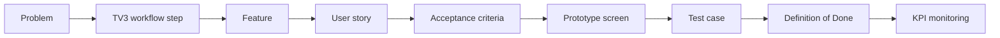
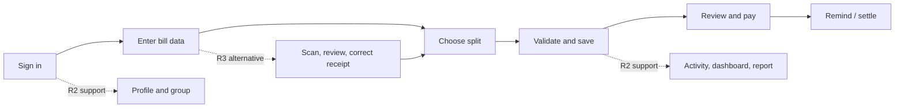

# Splitly — TV4: Product Backlog and Acceptance Criteria

## 1. Purpose

This document turns the TV3 current and future workflows into development-ready, testable requirements. It is the TV4 baseline for planning, implementation, prototype review, and test design.

The document defines the baseline for planning, implementation, prototype review, and testing.

### 1.1 Scope and release boundary

| Scope | Decision |
| --- | --- |
| **Current release / TV3 baseline** | Authenticated users create a bill manually, choose one payer and participants, split it equally/by person/by item, save it, review its status, record payment, and send reminders. Group, dashboard, report, activity, and notification capabilities support this flow. |
| **Future release / AI-assisted flow** | Receipt upload, OCR extraction, editable draft review, correction, and manual fallback. The user still chooses payer, participants, and allocation method. |
| **Explicitly out of scope for this baseline** | Multiple payers on one bill, cross-bill/group net settlement, automatic bank-transfer verification, group fund/wallet, guest lifecycle, recurring bills, exports, and AI payer recommendation. They must not be inferred from older reference documents as current commitments. |

### 1.2 Business rules used by all bill stories

1. A bill has one designated payer (`payerId`), at least one participant, a positive total, creation date, payment deadline, and one split method.
2. Supported split methods are `equal`, `people-based` (shown as **By person**), and `item-based` (shown as **By item**).
3. The financial invariant is mandatory: after the selected allocation and deterministic rounding, the sum of all `amountOwed` values must equal `totalAmount` exactly. The system must show the difference and block saving when it is not zero.
4. For item-based splitting, an item may be assigned to one or more participants. The item subtotal, taxes, discounts, service charge, or other difference are allocated proportionally so that the final participant total equals the confirmed bill total.
5. The payer's own share is recorded as already paid; a participant may make a partial payment. A bill is settled only when every non-opted-out participant has paid their owed amount.
6. OCR output is a draft, never final financial data. It remains editable and cannot bypass the normal validation and save rules.

## 2. Product backlog

Priority: **P0** = required for the current demonstrable flow; **P1** = important supporting capability; **P2** = approved future/OCR scope. Estimates are story points, not elapsed time. Total estimate: **107 points**.

| ID | Epic | Feature | User story | Priority | Estimate | Acceptance criteria | Dependency |
| --- | --- | --- | --- | --- | ---: | --- | --- |
| US-SPLIT-01 | E1 Account | Register and sign in | As a new user, I want to register and sign in, so that my bills and payments are protected. | P0 | 5 | AC-01 | Auth API; email verification policy |
| US-SPLIT-02 | E1 Account | Profile | As a signed-in user, I want to maintain my profile, so that group members can identify me. | P1 | 3 | AC-02 | US-SPLIT-01 |
| US-SPLIT-03 | E2 Groups | Create group | As an organiser, I want to create a spending group, so that I can reuse frequent members. | P1 | 5 | AC-03 | US-SPLIT-01; user search |
| US-SPLIT-04 | E2 Groups | Manage members | As a group owner, I want to add or remove group members, so that the group remains current. | P1 | 5 | AC-04 | US-SPLIT-03 |
| US-SPLIT-05 | E3 Bill setup | Bill information, payer, and participants | As a bill creator, I want to enter required bill information and select the payer and participants, so that Splitly can calculate the right obligations. | P0 | 3 | AC-05 | US-SPLIT-01; user/group search |
| US-SPLIT-06 | E3 Bill splitting | Equal split | As a bill creator, I want to divide a bill equally, so that all selected people owe the same amount. | P0 | 5 | AC-06 | US-SPLIT-05 |
| US-SPLIT-07 | E3 Bill splitting | By-person split | As a bill creator, I want to enter each person's amount or relative consumption, so that unequal usage is represented fairly. | P0 | 5 | AC-07 | US-SPLIT-05 |
| US-SPLIT-08 | E3 Bill splitting | By-item split | As a bill creator, I want to assign an item to one or more members, so that each person pays only for what they used. | P0 | 8 | AC-08 | US-SPLIT-05; item allocation |
| US-SPLIT-09 | E3 Bill lifecycle | Validate and save bill | As a bill creator, I want invalid data to be explained before saving, so that incorrect financial records are not persisted. | P0 | 8 | AC-09 | US-SPLIT-05–08; bill API |
| US-SPLIT-10 | E3 Bill lifecycle | History and detail | As a participant, I want to view bill details and status, so that I understand what I owe and why. | P0 | 3 | AC-10 | US-SPLIT-09 |
| US-SPLIT-11 | E4 Payments | Partial and full payment | As a participant, I want to record a partial or full payment, so that the outstanding balance is accurate. | P0 | 5 | AC-11 | US-SPLIT-10; payment API |
| US-SPLIT-12 | E4 Payments | Payment confirmation link | As a debtor, I want to open a secure payment request and see the amount and recipient details, so that I can make or request confirmation of payment. | P1 | 5 | AC-12 | US-SPLIT-11; token/email service |
| US-SPLIT-13 | E4 Payments | Payment reminder | As a creditor, I want to remind an unpaid participant, so that overdue payments are followed up consistently. | P1 | 5 | AC-13 | US-SPLIT-10; notification/email service |
| US-SPLIT-14 | E4 Payments | Opt out | As an incorrectly added participant, I want to opt out of a bill through a valid secure link, so that it no longer appears as my debt. | P1 | 3 | AC-14 | US-SPLIT-09; opt-out token |
| US-SPLIT-15 | E5 Insights | Personal dashboard | As a user, I want to see monthly spending and amounts owed/to receive, so that I can act on my finances. | P1 | 5 | AC-15 | Bills and payment status |
| US-SPLIT-16 | E5 Insights | Monthly report | As a user, I want a monthly spending report by trend and category, so that I can understand my expense pattern. | P1 | 8 | AC-16 | Categorised bills; report API |
| US-SPLIT-17 | E6 Transparency | Activity and notifications | As an affected user, I want visible bill events and notifications, so that changes and reminders are traceable. | P1 | 5 | AC-17 | Bill/payment/group events; socket/notification service |
| US-SPLIT-18 | E7 AI receipt input | Upload and validate receipt | As a bill creator, I want to upload a supported receipt image, so that the system can prepare a draft safely. | P2 | 5 | AC-18 | US-SPLIT-01; image validation; OCR provider |
| US-SPLIT-19 | E7 AI receipt input | Extract draft | As a bill creator, I want OCR to extract receipt fields and items into an editable draft, so that I type less information. | P2 | 8 | AC-19 | US-SPLIT-18; OCR provider |
| US-SPLIT-20 | E7 AI receipt input | Review and correct draft | As a bill creator, I want to correct OCR results before allocation, so that an OCR error cannot become a wrong bill. | P2 | 5 | AC-20 | US-SPLIT-19; US-SPLIT-05–09 |
| US-SPLIT-21 | E7 AI receipt input | Failure and manual fallback | As a bill creator, I want a clear retry and manual-entry path when OCR fails, so that I can still finish the bill. | P2 | 3 | AC-21 | US-SPLIT-18; manual bill flow |

## 3. Acceptance criteria

All examples below use VND. “Allocated total” means the final sum of participant obligations after the approved rounding rule.

| Ref. | User story | Given / When / Then acceptance criteria |
| --- | --- | --- |
| AC-01 | US-SPLIT-01 | **Given** a visitor provides valid unique registration details, **when** they submit registration and then valid credentials, **then** an account is created and protected application routes are available. **Given** a duplicate or invalid credential set, **when** it is submitted, **then** no session is created and field-level error feedback is shown. |
| AC-02 | US-SPLIT-02 | **Given** an authenticated user edits their permitted profile fields, **when** the update succeeds, **then** the stored profile and subsequently displayed identity show the new values. **When** invalid profile data is submitted, **then** it is rejected without overwriting valid data. |
| AC-03 | US-SPLIT-03 | **Given** an authenticated organiser enters a non-empty group name and optional description/members, **when** they confirm creation, **then** the group is persisted and appears in their group list. **When** the name exceeds 100 characters or is blank, **then** creation is rejected with an explanation. |
| AC-04 | US-SPLIT-04 | **Given** an existing group, **when** its authorised manager confirms a revised member selection, **then** the group detail and future participant search reflect the revised membership. **When** an invalid member payload is sent, **then** the existing list is retained. |
| AC-05 | US-SPLIT-05 | **Given** the creator opens Create Bill, **when** they provide bill name, category, creation date, deadline, one payer, participants, positive total, and split method, **then** the matching allocation form is available. **When** a mandatory field is missing, **then** save is blocked and the missing field is identified. |
| AC-06 | US-SPLIT-06 | **Given** a bill total of **120,000 VND** and three selected participants, **when** the creator chooses Equal split, **then** every participant owes **40,000 VND** and the allocated total is **120,000 VND**. **When** rounding is needed, **then** the visible shares still sum exactly to the total using the approved deterministic rounding rule. |
| AC-07 | US-SPLIT-07 | **Given** a total of **120,000 VND** and person inputs in a 1:2 relationship, **when** the system calculates the by-person allocation, **then** the participants owe **40,000 VND** and **80,000 VND** respectively. **When** supplied final amounts do not sum to the confirmed total, **then** saving is blocked and the difference is shown. |
| AC-08 | US-SPLIT-08 | **Given** a bill has one item worth **120,000 VND** assigned to three members, **when** the creator confirms the assignment, **then** each member owes **40,000 VND** and the item allocation sums to **120,000 VND**. **Given** item subtotals differ from the confirmed total because of tax, discount, service charge, or tip, **when** allocation is calculated, **then** the proportional adjustment and each final share are visible and the allocated total equals the confirmed total exactly. |
| AC-09 | US-SPLIT-09 | **Given** a bill has unresolved required fields, no valid item assignment, or a non-zero allocation difference, **when** Save Bill is selected, **then** the bill is not persisted and actionable validation feedback is shown. **Given** valid data, **when** it is saved, **then** payment statuses are created, the payer's own share is marked paid, an activity is logged, and other participants are notified without changing the saved financial result if a notification channel fails. |
| AC-10 | US-SPLIT-10 | **Given** a creator or participant opens an accessible saved bill, **when** its detail is loaded, **then** it displays bill name, payer, total, split method, relevant item/participant breakdown, amount owed/paid, and settlement status. **When** the user searches or filters history, **then** only matching accessible bills are returned. |
| AC-11 | US-SPLIT-11 | **Given** a participant owes **100,000 VND**, **when** a partial payment of **40,000 VND** is recorded, **then** their paid amount is 40,000 VND and remaining balance is 60,000 VND. **When** all eligible participant paid amounts reach their owed amounts, **then** the bill is marked settled and a settlement event is produced. |
| AC-12 | US-SPLIT-12 | **Given** a debtor opens a valid, unused payment/reminder token, **when** the payment page loads, **then** it shows the creditor, applicable bills, remaining amount, and supported payment details without exposing another user's request. **When** an expired, malformed, or already-used token is used, **then** no payment change occurs and a clear error is shown. |
| AC-13 | US-SPLIT-13 | **Given** an unpaid debt owned by the current creditor, **when** they send a reminder, **then** a reminder event is logged and the debtor receives the configured notification/email containing the outstanding amount. **When** another user attempts the same action, **then** the request is rejected. |
| AC-14 | US-SPLIT-14 | **Given** a participant opens their valid opt-out link, **when** they confirm opt-out, **then** they are excluded from their outstanding-debt view and an opt-out activity is recorded. **When** the token is invalid or belongs to another user, **then** no participant status changes. |
| AC-15 | US-SPLIT-15 | **Given** the user has bills in the current and previous month, **when** they open the dashboard, **then** it shows current-month spending, change from the previous month, amounts owed/to receive, and recent relevant activity from the same underlying bill/payment data. |
| AC-16 | US-SPLIT-16 | **Given** a user selects a month, **when** the report loads, **then** bill count, total spending, unpaid debt, overdue count, spending trend, and category breakdown are calculated from that user's accessible bills. **When** there is no data for the month, **then** a zero/empty state is shown rather than stale data. |
| AC-17 | US-SPLIT-17 | **Given** a bill is created, paid, settled, opted out of, deleted, or reminded, **when** the related operation succeeds, **then** the relevant activity is recorded and eligible affected users receive a notification. **When** a user opens the activity/notification view, **then** only their permitted events are visible. |
| AC-18 | US-SPLIT-18 | **Given** the creator supplies a BMP, PNG, JPEG, or WEBP receipt image no larger than **20 MB**, **when** they start scanning, **then** the system verifies the actual MIME type, rejects images with a short side under 4 px or ratio over 5:1, and scales a long side over 2240 px before OCR. **When** validation fails, **then** scanning does not start and the user can replace the file or enter manually. |
| AC-19 | US-SPLIT-19 | **Given** a validated receipt, **when** the OCR provider returns a result, **then** the system creates an editable draft containing every available merchant/bill name, date, category, line item name, quantity, unit price, line amount, subtotal, tax, discount, total, and payment method. **When** a field is missing or uncertain, **then** it is visibly marked rather than invented. |
| AC-20 | US-SPLIT-20 | **Given** an OCR draft with an uncertain price or missing item, **when** the creator edits, adds, or removes values and confirms them, **then** the corrected values carry into the normal Create Bill form. **When** the creator attempts to save with unresolved mandatory data or an allocation mismatch, **then** normal AC-05 to AC-09 validation blocks the save. |
| AC-21 | US-SPLIT-21 | **Given** OCR times out, is unavailable, or returns invalid content, **when** processing ends, **then** the user sees an understandable error and can retry, replace the image, or choose manual entry. No bill is created from a failed scan. |

## 4. KPI plan

The KPI targets are measured from the baseline sprint. Events exclude test accounts and use a stable `billId`/user identifier policy.

| KPI | Formula and event source | Target | Cadence | Decision supported |
| --- | --- | --- | --- | --- |
| K1 Bill creation completion | `valid_bill_saved / bill_create_started`; events: `bill_create_started`, `bill_saved` | ≥ 90% monthly | Weekly | Finds form/validation friction. |
| K2 Financial allocation integrity | `saved_bills where sum(amountOwed) = totalAmount / saved_bills` | 100% | Per release and daily monitor | Guards the core financial invariant. |
| K3 Manual entry time | Median from `bill_create_started` to `bill_saved` for manual flow | ≤ 3 minutes | Monthly | Measures the current workflow bottleneck. |
| K4 OCR usable-draft rate | `ocr_drafts_continued_to_review / successful_ocr_scans` | ≥ 85% | Weekly after OCR release | Measures extraction usefulness, not unreviewed accuracy. |
| K5 OCR-to-saved-bill rate | `bills_saved_from_ocr / ocr_scans_started` | ≥ 65% | Weekly after OCR release | Reveals whether scanning reduces effort. |
| K6 Payment follow-up conversion | `debts with full/partial payment within 7 days of reminder / reminders_sent` | ≥ 30% | Monthly | Tests reminder value. |
| K7 Settlement latency | Median days from bill creation to settlement | Baseline first; improve by 15% | Monthly | Shows whether payment tracking helps groups settle. |
| K8 Notification reliability | `successfully delivered notifications / notification attempts`, tracked by channel | ≥ 98% provider acceptance | Weekly | Prevents silent loss of reminders and bill events. |

## 5. Definition of Done

A user story is Done only when all applicable conditions below are true:

- The implementation satisfies every linked acceptance criterion, including the negative/error path.
- Automated tests cover the linked test cases; the financial tests include exact-total and rounding assertions.
- Request validation, authentication, and authorisation are enforced server-side; a client-side check alone is insufficient.
- Error states are understandable, do not persist partial/incorrect financial data, and provide a safe recovery path.
- Data changes are reflected in the applicable history, payment, dashboard, activity, and notification views.
- The code has passed review, lint/build checks, and regression tests for the dependent flow.
- The UI is usable at supported mobile and desktop widths and has loading, empty, and failure states.
- User-visible Vietnamese wording, labels, currency formatting, and dates are reviewed for consistency.
- Required activity/metric events are emitted without leaking receipt image data, tokens, bank account details, or other secrets.
- The relevant backlog row, acceptance criteria, prototype reference, test case, and traceability matrix are updated; known limitations are recorded rather than hidden.

For OCR stories additionally:

- The original receipt is never treated as a confirmed bill without user review.
- Supported format/size/resize rules are identical in the UI, API, help text, and tests.
- Provider failure, timeout, malformed response, and manual fallback are tested.

## 6. Requirement Traceability Matrix

Problem IDs: `P1` calculation/transcription errors; `P2` unclear reimbursement status; `P3` awkward follow-up; `P4` repeated group setup; `P5` lack of visibility/audit trail; `P6` OCR effort, reliability, and privacy risk. Workflow step IDs and screen IDs refer to the approved TV3 workflow and prototype documents.

| Problem | Workflow | Feature | User story | Acceptance criteria | Prototype screen | Test case |
| --- | --- | --- | --- | --- | --- | --- |
| P5 | CS-01 | Register and sign in | US-SPLIT-01 | AC-01 | C01 / F01 (authenticated entry) | TC-AUTH-01 |
| P4, P5 | CS-02, CS-05 | Profile | US-SPLIT-02 | AC-02 | C01 (account context) | TC-PROFILE-01 |
| P4 | CS-02, CS-05 | Create group | US-SPLIT-03 | AC-03 | C01, C05 | TC-GRP-01 |
| P4 | CS-05 | Manage members | US-SPLIT-04 | AC-04 | C05, F07 | TC-GRP-02 |
| P1, P4 | CS-03–CS-06 | Bill setup, payer, participants | US-SPLIT-05 | AC-05 | C03–C06; F07 | TC-BILL-01 |
| P1 | CS-07A | Equal split | US-SPLIT-06 | AC-06 | C06, C09 | TC-SPLIT-01 |
| P1 | CS-07B | By-person split | US-SPLIT-07 | AC-07 | C06, C09 | TC-SPLIT-02 |
| P1 | CS-07C, CS-08 | By-item split | US-SPLIT-08 | AC-08 | C07–C09; F08–F09 | TC-SPLIT-03, TC-SPLIT-04 |
| P1, P5 | CS-09, CS-10 | Validate and save | US-SPLIT-09 | AC-09 | C09–C10; F09–F10 | TC-BILL-02 |
| P2, P5 | CS-11 | History and detail | US-SPLIT-10 | AC-10 | C10, F10 | TC-BILL-03 |
| P2 | CS-12 | Partial and full payment | US-SPLIT-11 | AC-11 | C11 | TC-PAY-01 |
| P2 | CS-12 | Payment confirmation link | US-SPLIT-12 | AC-12 | C11 | TC-PAY-02 |
| P3, P5 | CS-13 | Payment reminder | US-SPLIT-13 | AC-13 | C11 | TC-PAY-03 |
| P2, P5 | CS-11–CS-12 | Opt out | US-SPLIT-14 | AC-14 | C10–C11 | TC-PAY-04 |
| P5 | CS-01, CS-11 | Personal dashboard | US-SPLIT-15 | AC-15 | C01 | TC-INS-01 |
| P5 | CS-11 | Monthly report | US-SPLIT-16 | AC-16 | No dedicated TV3 prototype screen | TC-INS-02 |
| P3, P5 | CS-10–CS-13 | Activity and notifications | US-SPLIT-17 | AC-17 | C10–C11, F10 | TC-NOTI-01 |
| P6 | FS-02–FS-05 | Upload and validate receipt | US-SPLIT-18 | AC-18 | F02–F04 | TC-OCR-01 |
| P6 | FS-06–FS-07 | Extract draft | US-SPLIT-19 | AC-19 | F04–F05 | TC-OCR-02 |
| P1, P6 | FS-08–FS-13 | Review and correct draft | US-SPLIT-20 | AC-20 | F05–F09 | TC-OCR-03 |
| P6 | FS-04–FS-05 | Failure and manual fallback | US-SPLIT-21 | AC-21 | F02–F06 | TC-OCR-04 |

## 7. Test-case index

The following are the minimum acceptance-level test cases. They can be expanded into detailed manual or automated test scripts without changing IDs.

| Test case | Scenario / minimum data | Expected result |
| --- | --- | --- |
| TC-AUTH-01 | Register, sign in, and submit duplicate/invalid credentials. | Valid user reaches protected area; invalid attempt creates no session and shows an error. |
| TC-PROFILE-01 | Update name/avatar/phone, refresh, then submit invalid profile data. | Valid values persist; invalid request leaves stored values unchanged. |
| TC-GRP-01 | Create group with valid details; create with blank and >100-character name. | Valid group appears; invalid groups are rejected. |
| TC-GRP-02 | Add then remove a member from an existing group. | Group detail and bill participant search use the updated member list. |
| TC-BILL-01 | Open Create Bill and omit each mandatory field in turn; select payer, people, and split type. | Missing field is identified; valid setup exposes the selected allocation form. |
| TC-SPLIT-01 | Equal split 120,000 VND among three people. | Three shares of 40,000 VND; allocated total 120,000 VND. |
| TC-SPLIT-02 | By-person split total 120,000 VND with 1:2 consumption; submit an inconsistent final allocation. | Shares are 40,000/80,000; inconsistent total cannot save. |
| TC-SPLIT-03 | Assign a 120,000-VND item to three members. | Each owes 40,000 VND; exact allocation invariant holds. |
| TC-SPLIT-04 | Allocate individual/shared items where item subtotal differs from bill total and requires rounding. | Adjustment is visible; deterministic rounding keeps final allocated total exactly equal to bill total. |
| TC-BILL-02 | Submit with no valid item/allocation mismatch, then submit a valid bill. | Invalid payload is not persisted; valid bill creates statuses, activity, and attempted notifications. |
| TC-BILL-03 | Open a bill as payer and participant; search/filter history. | Accessible detail has payer, shares, paid/owed, and status; history returns only matching accessible bills. |
| TC-PAY-01 | Record 40,000 then 60,000 against a 100,000-VND obligation; complete remaining participants. | Remaining balance becomes 60,000 then zero; bill settles only after every eligible obligation is paid. |
| TC-PAY-02 | Load payment page with valid, expired, malformed, and used tokens. | Valid token exposes only authorised request; invalid tokens change no payment data. |
| TC-PAY-03 | Creditor and non-creditor each attempt a reminder for the same debt. | Creditor reminder is logged/delivered; non-creditor receives forbidden response. |
| TC-PAY-04 | Use valid and invalid opt-out links. | Valid participant is excluded from debt views and activity is logged; invalid link has no effect. |
| TC-INS-01 | Load dashboard with known monthly bills/debts. | Spending, comparison, owed/to-receive, and recent activity match source bill/payment data. |
| TC-INS-02 | Load report for populated month and empty month. | Metrics/trend/category values match data; empty month shows an empty/zero state. |
| TC-NOTI-01 | Create, pay, settle, opt out, delete, and remind on a test bill. | Eligible users receive only relevant notifications; each successful event is traceable. |
| TC-OCR-01 | Upload accepted and rejected images: MIME spoof, >20 MB, long side >2240 px, short side <4 px, ratio >5:1. | Only valid inputs reach provider; valid large images are resized; rejected inputs offer safe recovery. |
| TC-OCR-02 | Scan a receipt with merchant, date, tax/discount, and several line items. | Editable draft contains available values; missing/uncertain values are clearly flagged. |
| TC-OCR-03 | Correct a malformed OCR draft, assign people/items, then attempt save with mismatch. | Corrections reach bill form; normal bill validation prevents invalid persistence. |
| TC-OCR-04 | Simulate provider timeout and malformed response. | User can retry/replace image/manual entry; no incomplete bill is saved. |

## 8. Mapping summary

This chain is the change-control rule for Splitly: a proposed feature change must update its user story, acceptance criteria, prototype reference, test case, and KPI/DoD impact before it is accepted into a sprint.

## 9. Product Backlog controls

### 9.1 Shared glossary

These terms must be used consistently in Vietnamese UI copy, stakeholder discussion, user stories, tests, and code/API documentation. They reduce the risk that a technically correct implementation solves the wrong business problem.

| Term | Agreed business meaning |
| --- | --- |
| **Bill** | One shared expense record containing its total, payer, participants, allocation, and payment progress. |
| **Payer** | The single person who paid the supplier up front for this bill. This is not necessarily every person who consumed an item. |
| **Participant** | A person included in the bill's allocation. Their obligation can be zero only when the selected split rule produces zero. |
| **Amount owed** | The participant's final allocated responsibility after adjustment and rounding. |
| **Amount paid** | The cumulative amount recorded as paid by that participant toward the bill. |
| **Remaining amount** | `amountOwed − amountPaid`, never below zero. |
| **Equal split** | The confirmed bill total is divided among selected participants using the deterministic rounding rule. |
| **By person** | The creator enters final amounts or relative consumption for participants; final amounts must still equal the confirmed total. |
| **By item** | One or more participants are assigned to each item; shared items are divided among their assigned people and any bill-level adjustment is distributed proportionally. |
| **Settled** | Every eligible, non-opted-out participant has paid at least their amount owed. It does not prove that a bank transfer happened automatically. |
| **Opt out** | A securely verified participant disputes their inclusion and is excluded from the app's outstanding-debt view; the action remains auditable. |
| **OCR draft** | Editable data extracted from a receipt image. It is not a confirmed financial record until the creator reviews, allocates, validates, and saves it. |

### 9.2 Business-value map

| Objective | Customer/business value | Success signal | Backlog items |
| --- | --- | --- | --- |
| BV-01 Fair allocation | Reduces calculation errors and disputes about who consumed what. | K2 is 100%; fewer allocation corrections. | US-SPLIT-05–09 |
| BV-02 Clear reimbursement | Makes each person's debt, payment, and settlement state visible. | K7 improves; users can identify remaining balance. | US-SPLIT-10–14 |
| BV-03 Lower follow-up friction | Gives creditors a structured, auditable way to remind debtors. | K6 reminder conversion. | US-SPLIT-13, US-SPLIT-17 |
| BV-04 Less repeated setup | Lets recurring social groups reuse member lists and profiles. | Reduced time to start a bill; group reuse feedback. | US-SPLIT-02–05 |
| BV-05 Spending awareness | Turns bill data into actionable personal spending information. | Dashboard/report usage and report accuracy checks. | US-SPLIT-15–16 |
| BV-06 Faster bill entry with user control | Reduces receipt transcription while preserving human confirmation of financial data. | K3, K4, and K5. | US-SPLIT-18–21 |

### 9.3 Backlog refinement and Definition of Ready

The Product Owner facilitates refinement at least once per sprint and before release planning with a developer and QA representative. Every approved change updates the affected PBI, acceptance criteria, test case, priority, estimate, and traceability link.

A PBI is **Ready for sprint selection** only when all conditions hold:

1. It has a stable ID, actor, plain-language outcome, business-value objective, priority/rank, and dependency.
2. Its acceptance criteria and at least one linked test case are unambiguous and testable.
3. Relevant workflow and prototype IDs are linked, or the lack of a screen is an accepted design action.
4. Required domain/data/API assumptions, security/privacy concerns, and open risks are visible.
5. Estimate uses the team's agreed Fibonacci scale. An 8-point item is split or explicitly approved as an exception before sprint commitment.
6. The Product Owner, developer, and QA representative agree that no unknown blocks normal implementation/testing.

### 9.4 Release Backlog and story map

The **Product Backlog** is the complete ordered set in Section 2. The **Release Backlog** is the selected, viable subset for each release.

| Release order | Release outcome / business value | Selected stories in planned order | Story points | Exit criterion |
| --- | --- | --- | ---: | --- |
| R1 — Viable manual expense sharing | Users can securely create, divide, save, view, pay, and follow up on a shared expense. | US-SPLIT-01, US-SPLIT-05, US-SPLIT-06, US-SPLIT-07, US-SPLIT-08, US-SPLIT-09, US-SPLIT-10, US-SPLIT-11, US-SPLIT-13 | 47 | A group can complete the CS-01–CS-13 flow and pass all linked R1 AC/test cases. |
| R2 — Reuse, transparency, and insight | Users manage frequent groups, receive traceable notifications, and understand their spending. | US-SPLIT-02, US-SPLIT-03, US-SPLIT-04, US-SPLIT-12, US-SPLIT-14, US-SPLIT-15, US-SPLIT-16, US-SPLIT-17 | 39 | R1 remains regression-safe; R2 AC/test cases and data-access rules pass. |
| R3 — AI-assisted bill-entry experiment | Users can scan a receipt, correct the draft, and safely fall back to manual entry. | US-SPLIT-18, US-SPLIT-19, US-SPLIT-20, US-SPLIT-21 | 21 | AC-18–AC-21, OCR-specific DoD, provider risk review, and privacy decision pass. |

### 9.5 Packets — implementation change scope

A packet is the bounded set of product/code components for a release item. It is used for sprint planning and impact review.

| Packet | Backlog items | Likely components to change or verify | Primary responsibility |
| --- | --- | --- | --- |
| PKT-01 Account access | US-SPLIT-01–02 | User model/validation/controller/routes, auth middleware/JWT, Auth/Profile pages, user API client. | Development; QA verifies AC-01/02. |
| PKT-02 Group roster | US-SPLIT-03–04 | Group model/validation/controller/routes, group pages/dialogs, participant/group search. | Development; TV4 confirms BV-04. |
| PKT-03 Bill setup and allocation | US-SPLIT-05–09 | Bill validation/model/service/routes, `BillCreate`, `activeBillSlice`, payer/participant dialogs, three split components. | Development; QA executes TC-BILL-01/02 and TC-SPLIT-01–04. |
| PKT-04 Bill lifecycle and payment | US-SPLIT-10–14 | History/detail views, debt/payment/confirmation controllers, payment token model/pages, reminder and opt-out flows. | Development; QA executes TC-BILL-03 and TC-PAY-01–04. |
| PKT-05 Insight and transparency | US-SPLIT-15–17 | Dashboard/report/activity/notification APIs, pages, charts, sockets, notification delivery. | Development; QA executes TC-INS-01/02 and TC-NOTI-01. |
| PKT-06 OCR-assisted entry | US-SPLIT-18–21 | OCR page/client, bill scan validation/service/provider, bill-draft parser, create-bill integration, image/privacy/error handling. | Development; QA executes TC-OCR-01–04; Product Owner approves release gate. |
