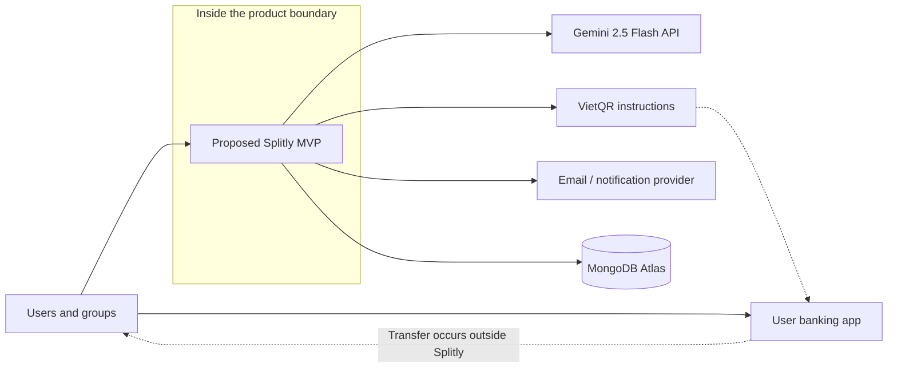

# Splitly — Project Vision and Scope

## 1. Document Purpose

This document defines the proposed Splitly product, its target users, business problem, MVP boundary, assumptions, constraints, and future direction. The project starts from approved documentation and is planned as a new build. Existing repository content is reference or proof-of-concept material and does not establish that a feature is already available.

The broader business current state is the fragmented pre-Splitly process described in the proposal documents. For continuity with the original workflow materials, `Current_State_Workflow.md` uses **current state** as the manual-entry comparison baseline, while `Future_State_Workflow.md` describes the Gemini-assisted target. Neither label claims that the repository is an operating product.

## 2. Product Overview

Splitly is a proposed responsive web application for Vietnamese users who share dining, travel, household, or social expenses. It will bring group setup, bill entry, calculation, payment assistance, payment confirmation, reminders, and history into one reviewable workflow.

The MVP will offer two bill-input paths:

1. **Manual entry:** the user enters bill information and selects equal, by-person, or by-item allocation.
2. **Gemini-assisted receipt entry:** the user uploads a supported receipt image, Gemini 2.5 Flash prepares an editable draft, and the user reviews and corrects the draft before saving.

Both paths use the same authoritative validation, splitting, payment-status, and audit rules. AI output never becomes a financial record without human confirmation.

## 3. Product Vision

> **To make shared expenses quick, fair, and transparent for Vietnamese groups by connecting receipt entry, explainable allocation, payment assistance, and follow-up in one user-controlled workflow.**

Splitly is not a wallet, a bank, or a guarantee that a transfer occurred. It helps users prepare and understand obligations, open VietQR-compatible payment instructions, record a payment declaration, and let the appropriate creditor confirm or reject it.

## 4. Mission Statement

> **Splitly helps groups transform a shared expense into a clear, verifiable record that shows who paid, who participated, how each amount was calculated, and what remains unsettled.**

## 5. Product Positioning

### 5.1 Current Business Position

Before Splitly, users combine receipts, calculators, spreadsheets or notes, group chat, personal QR images, and banking applications. One organizer manually reconciles calculations and payment status.

### 5.2 Proposed MVP Position

Splitly will be a Vietnamese-localized shared-expense application with reusable groups, three splitting methods, manual and Gemini-assisted bill entry, VietQR assistance, payment declaration and confirmation, reminders, and traceable history.

### 5.3 Future Position

After the MVP is validated, Splitly may add PDF receipt input, the TingTing chatbot, advanced reports, and AI payer recommendations. Cross-bill debt clearing is a current MVP commitment: it will calculate explainable net payment instructions without initiating or automatically verifying transfers.

### 5.4 Positioning Statement

For Vietnamese social groups that need to settle shared expenses, Splitly is a structured bill-sharing application that connects allocation and payment follow-up. Unlike a calculator, spreadsheet, or chat thread, it keeps the confirmed bill, participant obligations, payment status, and history together. Unlike fully automated financial claims, it preserves human review of receipt data and payment confirmation.

## 6. Problem Statement

### 6.1 Primary Problem

Shared bills become difficult when people consume different items, share selected dishes, or need tax, fees, tips, and discounts allocated fairly. The upfront payer often performs detailed transcription, calculation, communication, and payment tracking across several disconnected tools.

### 6.2 Current-State Pain Points

- Receipt data is manually retyped and is vulnerable to omission or error.
- Equal splitting can be unfair; by-person and by-item approaches require additional calculation.
- The calculation, chat discussion, bank instructions, and transaction evidence are fragmented.
- Participants may not understand how their amount was derived or whether the payer recorded their transfer.
- Reminders are repetitive and socially uncomfortable.
- There is no shared, consistent history for the group.

### 6.3 Product Opportunity

Splitly can reduce coordination effort without pretending that AI or a QR image proves financial truth. The product opportunity is to automate preparation and arithmetic while keeping people responsible for correcting receipt data, deciding allocation, transferring through their bank, and confirming payment.

## 7. Target Users

### 7.1 Primary Persona — Social Dining Organizer

A student or young professional pays for a meal involving friends who consumed individual and shared items.

Goals:

- create a correct breakdown quickly;
- explain each person's amount;
- share convenient payment instructions;
- know who has paid without rereading chat and bank history;
- remind unpaid participants consistently.

Frustrations:

- long or unclear receipts;
- tax, fee, discount, and rounding mismatches;
- repeated member and item entry;
- ambiguous transfer descriptions;
- awkward manual reminders.

### 7.2 Secondary Persona — Travel Group Organizer

Coordinates several expenses across a trip and needs reusable membership, clear history, and separate settlement status for each bill.

### 7.3 Secondary Persona — Roommate Expense Coordinator

Tracks shared household purchases and utilities and needs transparent obligations and follow-up without operating a formal accounting system.

## 8. Product Goals and Measures

| Goal | Intended outcome | MVP success signal |
| --- | --- | --- |
| Correct allocation | Users can split equally, by person, or by item with deterministic rounding. | Every accepted calculation test preserves `sum(shares) = confirmed total`. |
| Faster entry | Manual entry is usable and Gemini can reduce transcription where receipt quality permits. | Users complete the selected UAT flow; OCR drafts are editable and never auto-saved. |
| Transparent settlement | Authorized users can see obligations, payment claims, confirmations, and remaining amounts. | Priority payment and history scenarios pass UAT with no Critical/High defects. |
| Safe assistance | Provider failure does not create false financial records or block manual entry. | Gemini, VietQR, and notification failure tests lead to a safe fallback. |
| Ten-week delivery | Six members deliver a demonstrable, documented MVP within approved capacity. | MVP acceptance evidence, deployment, runbook, and post-MVP backlog are complete in Week 10. |

## 9. MVP Scope

### 9.1 In Scope

- Registration, sign-in, verification, and basic profile management.
- Group creation and member management.
- Bill creation with one upfront payer and selected participants.
- Three splitting methods: equal, by person, and by item.
- Manual entry of bill fields and items.
- Receipt-image upload for JPG/JPEG, PNG, and WebP up to 10 MB.
- Gemini 2.5 Flash extraction into an editable draft with explicit user review and manual fallback.
- Item assignment, shared-item calculation, and a documented rule for tax, fee, tip, discount, and rounding adjustments.
- Bill validation, saved detail, history, and participant-level payment state.
- Cross-bill debt clearing that shows explainable net obligations and payment instructions while retaining the source bill records.
- VietQR-compatible payment instructions without fund custody or automatic bank verification.
- Payment declaration followed by creditor confirmation or rejection.
- Creditor-initiated reminders and essential in-app/real-time or email notifications.
- Transactional outbox and background notification worker so committed bill/payment events can be delivered and retried asynchronously without changing financial state.
- Responsive Vietnamese web experience.
- Demonstration deployment using Vercel, Render, and MongoDB Atlas.

### 9.2 Out of Scope for the MVP

- TingTing chatbot.
- Advanced analytics and reports beyond essential MVP status summaries.
- AI payer recommendation.
- PDF receipt upload; maintain it in the future backlog.
- Multiple upfront payers for one bill.
- Automatic bank-transfer verification, payment gateways, a wallet, or custody of funds.
- Native mobile applications, offline synchronization, multiple currencies, recurring bills, accounting exports, and production-scale SLA.
- Separate message broker, microservices, or large-scale event platform; the MVP uses MongoDB as its outbox store and a worker from the same modular backend codebase.

## 10. Scope Boundary

Splitly stores and presents application records. Gemini prepares a receipt draft, VietQR encodes payment instructions, and users move money through their own banks. A payment status in Splitly represents the approved declaration/confirmation workflow, not independent bank evidence.

## 11. Assumptions

- Naver is the organizational sponsor in the project context.
- Six members can contribute approximately two working days per week for ten weeks.
- The team can obtain and securely configure Gemini 2.5 Flash API access and suitable provider quotas for development and UAT.
- Users have a modern browser, internet connection, email access, and a device capable of selecting or photographing a receipt.
- The primary currency is VND and the primary interface language is Vietnamese.
- UAT may use synthetic, anonymized, or consented receipt and payment data.
- Vercel, Render, and MongoDB Atlas are sufficient for the demonstration baseline, subject to free-tier limits and cold-start behavior.

## 12. Constraints

- The fixed ten-week schedule provides approximately 120 person-days of gross team capacity.
- Receipt extraction quality varies by image, language, layout, and Gemini behavior.
- JPG/JPEG, PNG, and WebP are the only planned MVP receipt formats, with a 10 MB maximum; PDF is deferred.
- Bank details, receipt content, email, membership, and expense history require access control, redacted logs, and clear retention decisions.
- External provider terms, quotas, prices, and availability may change.
- Splitly cannot claim automatic transfer success or regulatory exemption merely because it does not hold funds.

## 13. Future Backlog

| Candidate | Reason for deferral |
| --- | --- |
| PDF receipt input | Requires a separate validation, rendering, security, and multi-page extraction contract. |
| TingTing chatbot | Helpful but not necessary to complete the core expense-sharing workflow. |
| Advanced reports | Depends on reliable bill/payment data and validated user demand. |
| AI payer recommendation | Requires evidence of user value, explainability, and acceptable privacy behavior. |
| Separate broker or independently extracted notification service | Add only when measured reliability, scale, or ownership needs exceed the MongoDB outbox and modular worker. |
| Multiple payers and multi-currency | Require material changes to the domain and calculation model. |
