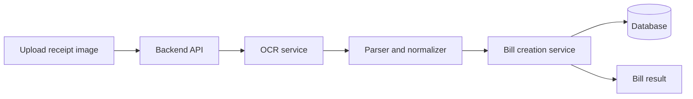

Bạn đang làm việc trực tiếp trong repository hiện tại của nhóm tôi.

## Bối cảnh

Nhóm tôi đã phát triển một tính năng liên quan đến hóa đơn, bao gồm:

1. Người dùng tải ảnh hóa đơn lên.
2. Hệ thống sử dụng OCR để trích xuất thông tin từ hóa đơn.
3. Dữ liệu OCR được xử lý và chuẩn hóa.
4. Hệ thống sử dụng các dữ liệu đó để tạo bill tự động.
5. Bill được lưu hoặc hiển thị cho người dùng kiểm tra.

Giảng viên yêu cầu nhóm thực hiện một **Proof of Concept — PoC** cho tính năng này.

Mục tiêu của PoC không phải là xây dựng lại toàn bộ sản phẩm, mà là chứng minh rằng toàn bộ luồng kỹ thuật:

**Upload hóa đơn → OCR → xử lý dữ liệu → tạo bill tự động → trả kết quả**

có thể hoạt động end-to-end.

## Nhiệm vụ của bạn

Hãy đọc và phân tích toàn bộ repository hiện tại trước khi chỉnh sửa code.

Đặc biệt, hãy tìm các thành phần liên quan đến:

* Upload ảnh hóa đơn.
* OCR hoặc AI service.
* API xử lý hóa đơn.
* Logic parse và chuẩn hóa dữ liệu.
* Entity, model, schema hoặc DTO của bill.
* Logic tạo bill.
* Database.
* Frontend hoặc màn hình hiển thị kết quả.
* Các biến môi trường và dịch vụ bên thứ ba.
* Test hiện có.
* Docker hoặc cách chạy dự án.

Không được tự giả định kiến trúc khi repository đã có implementation tương ứng.

## Mục tiêu chính

Xây dựng hoặc hoàn thiện một PoC có thể chạy demo end-to-end cho toàn bộ luồng OCR đến bill.

Luồng demo tối thiểu:

1. Người dùng chọn hoặc upload một ảnh hóa đơn.
2. Frontend hoặc client gửi ảnh lên backend.
3. Backend kiểm tra file đầu vào.
4. Hệ thống OCR đọc nội dung hóa đơn.
5. Kết quả OCR được chuyển thành dữ liệu có cấu trúc.
6. Hệ thống chuẩn hóa dữ liệu.
7. Hệ thống tạo một bill từ dữ liệu đã trích xuất.
8. Kết quả bill được trả về và hiển thị rõ ràng.
9. Trong trường hợp project hiện tại có database, bill được lưu vào database.
10. Có thể kiểm tra lại kết quả bằng API response, UI hoặc database.

## Dữ liệu cần trích xuất

Dựa trên cấu trúc hiện tại của repository, hãy ưu tiên trích xuất các trường sau nếu hóa đơn có chứa:

* Tên cửa hàng hoặc merchant.
* Địa chỉ cửa hàng.
* Ngày và giờ giao dịch.
* Mã hóa đơn.
* Danh sách sản phẩm.
* Tên sản phẩm.
* Số lượng.
* Đơn giá.
* Thành tiền của từng sản phẩm.
* Tổng tiền trước giảm giá.
* Giảm giá.
* Thuế.
* Phí dịch vụ.
* Tổng thanh toán.
* Phương thức thanh toán.
* Đơn vị tiền tệ.

Không bắt buộc mọi hóa đơn đều phải có đầy đủ trường. Các trường không nhận diện được phải được xử lý an toàn, không làm toàn bộ request bị lỗi.

## Phạm vi PoC

PoC phải tập trung vào tính khả thi kỹ thuật, không cần xây dựng một sản phẩm production hoàn chỉnh.

Ưu tiên:

* Chạy được end-to-end.
* Dễ demo.
* Dễ kiểm tra kết quả.
* Tái sử dụng code hiện tại.
* Thay đổi ít nhất có thể.
* Có error handling cơ bản.
* Có logging đủ để giải thích luồng xử lý.
* Có hướng dẫn chạy rõ ràng.

Không ưu tiên:

* Giao diện quá đẹp.
* Refactor toàn bộ repository.
* Tối ưu hiệu năng phức tạp.
* Triển khai production.
* Xây dựng hệ thống phân quyền đầy đủ.
* Hỗ trợ mọi định dạng hóa đơn trên thị trường.

## Yêu cầu phân tích trước khi code

Trước khi thay đổi code, hãy tạo một báo cáo ngắn gồm:

### 1. Kiến trúc hiện tại

Mô tả luồng hiện tại của tính năng OCR và bill:

```text
Client
  → Upload API
  → OCR service
  → Parsing/Normalization
  → Bill creation
  → Database/Response
```

Nêu rõ:

* File nào phụ trách từng bước.
* Thành phần nào đã hoàn thành.
* Thành phần nào đang thiếu.
* Thành phần nào đang có lỗi hoặc chưa kết nối với nhau.
* Các dependency bên ngoài đang được sử dụng.

### 2. Đánh giá mức độ sẵn sàng

Phân loại từng phần:

* Đã hoạt động.
* Hoạt động một phần.
* Chưa có.
* Có code nhưng chưa được tích hợp.
* Không thể chạy do thiếu cấu hình.

### 3. Kế hoạch PoC

Đưa ra kế hoạch chỉnh sửa nhỏ nhất để tạo được demo end-to-end.

Sau phần phân tích, hãy chủ động triển khai PoC. Không dừng lại chỉ ở việc đưa ra kế hoạch.

## Yêu cầu implementation

### Upload file

* Chấp nhận ít nhất ảnh JPG, JPEG và PNG.
* Có giới hạn kích thước file hợp lý.
* Từ chối file không hợp lệ bằng thông báo rõ ràng.
* Không tin tưởng trực tiếp filename do người dùng gửi lên.
* Dọn file tạm sau khi xử lý nếu repository dùng local temporary storage.

### OCR

Ưu tiên sử dụng OCR service đang có trong repository.

Nếu OCR hiện tại phụ thuộc vào API key hoặc dịch vụ chưa cấu hình:

1. Giữ nguyên integration thật.
2. Tạo `.env.example` với tên biến cần thiết.
3. Viết hướng dẫn cấu hình.
4. Có thể bổ sung chế độ mock hoặc fixture để demo luồng end-to-end khi chưa có API key.
5. Mock phải được tách rõ với production flow, ví dụ:

```env
OCR_MODE=real
```

hoặc:

```env
OCR_MODE=mock
```

Không được thay toàn bộ OCR thật bằng dữ liệu hard-code mà không giải thích.

### Chuẩn hóa dữ liệu OCR

Tạo hoặc sử dụng một cấu trúc dữ liệu trung gian rõ ràng, ví dụ:

```json
{
  "merchantName": "ABC Store",
  "invoiceNumber": "INV-001",
  "transactionDate": "2026-07-18T10:30:00",
  "currency": "VND",
  "items": [
    {
      "name": "Product A",
      "quantity": 2,
      "unitPrice": 25000,
      "lineTotal": 50000
    }
  ],
  "subtotal": 50000,
  "discount": 0,
  "tax": 0,
  "serviceFee": 0,
  "total": 50000,
  "confidence": 0.9,
  "rawText": "..."
}
```

Điều chỉnh field name theo convention hiện có trong repository.

Yêu cầu:

* Trim chuỗi.
* Chuẩn hóa số tiền.
* Xử lý dấu chấm và dấu phẩy.
* Xử lý ký hiệu tiền tệ.
* Không dùng floating-point thiếu kiểm soát cho tiền nếu stack hiện tại hỗ trợ decimal hoặc integer minor unit.
* Kiểm tra quantity, unit price và line total.
* Kiểm tra subtotal và total.
* Không crash khi thiếu trường.
* Giữ lại raw OCR output để debug nếu phù hợp.

### Tạo bill tự động

Dựa trên dữ liệu đã chuẩn hóa:

* Tạo bill theo model hiện tại của hệ thống.
* Tạo các bill items tương ứng.
* Tính hoặc xác minh tổng tiền.
* Không tin hoàn toàn vào total do OCR trả về.
* Nếu tổng các item khác với tổng hóa đơn, trả về warning hoặc trạng thái cần xác nhận.
* Nếu repository có transaction database, sử dụng transaction khi lưu bill và bill items.
* Tránh tạo dữ liệu bill dở dang khi có lỗi giữa quá trình.

### API response

API PoC nên trả về dữ liệu đủ để demo, ví dụ:

```json
{
  "success": true,
  "ocr": {
    "rawText": "...",
    "confidence": 0.9
  },
  "extractedData": {
    "merchantName": "ABC Store",
    "items": [],
    "total": 50000
  },
  "bill": {
    "id": "bill-id",
    "status": "DRAFT",
    "items": [],
    "total": 50000
  },
  "warnings": []
}
```

Điều chỉnh theo response convention hiện tại.

### UI hoặc demo client

Nếu repository đã có frontend:

* Tận dụng màn hình hoặc component hiện có.
* Cho phép chọn ảnh.
* Hiển thị trạng thái loading.
* Hiển thị lỗi.
* Hiển thị dữ liệu đã trích xuất.
* Hiển thị bill được tạo.
* Hiển thị warning nếu tổng tiền không khớp hoặc OCR thiếu dữ liệu.

Nếu repository chưa có frontend phù hợp:

* Tạo cách demo đơn giản nhất bằng Swagger, Postman collection, curl hoặc một trang HTML tối giản.
* Không xây dựng frontend lớn chỉ để phục vụ PoC.

## Kiểm thử

Bổ sung các test phù hợp với stack hiện tại.

Tối thiểu cần có:

1. Unit test cho logic parse hoặc normalize tiền.
2. Unit test cho mapping OCR result sang bill.
3. Test khi thiếu merchant name.
4. Test khi thiếu item.
5. Test khi total không khớp tổng item.
6. Test file không hợp lệ.
7. Test OCR service trả lỗi.
8. Test happy path tạo bill thành công.

Nếu việc integration test với OCR thật gây tốn phí hoặc không ổn định, hãy mock OCR service trong test.

Không gọi dịch vụ OCR thật trong unit test.

## Dữ liệu demo

Chuẩn bị ít nhất:

* Một ảnh hóa đơn hợp lệ.
* Một fixture OCR tương ứng.
* Một trường hợp dữ liệu thiếu.
* Một trường hợp total không khớp.
* Một trường hợp file không hợp lệ.

Lưu dữ liệu demo vào thư mục hợp lý, ví dụ:

```text
poc/
fixtures/
samples/
test-resources/
```

Tuân theo cấu trúc project hiện tại.

## Logging

Thêm logging ở các bước chính:

* Nhận file.
* Gọi OCR.
* OCR thành công hoặc thất bại.
* Parse dữ liệu.
* Validate dữ liệu.
* Tạo bill.
* Lưu database.
* Hoàn thành request.

Không log:

* API key.
* Token.
* Dữ liệu nhạy cảm không cần thiết.
* Toàn bộ ảnh dưới dạng base64.

## Tiêu chí thành công của PoC

PoC được xem là thành công khi:

1. Repository có thể chạy theo hướng dẫn.
2. Có thể upload một ảnh hóa đơn.
3. OCR trả được raw text hoặc structured data.
4. Dữ liệu được chuẩn hóa.
5. Bill được tạo tự động.
6. Bill items và total được hiển thị hoặc lưu.
7. Luồng có thể demo từ đầu đến cuối.
8. Có ít nhất một test happy path chạy thành công.
9. Có xử lý lỗi OCR cơ bản.
10. Có tài liệu mô tả cách chạy và kết quả PoC.

## Tài liệu đầu ra

Tạo một tài liệu Markdown, ưu tiên tên:

```text
docs/OCR_BILL_POC.md
```

Nếu repository có convention tài liệu khác thì sử dụng convention đó.

Tài liệu cần bao gồm:

### 1. Mục tiêu PoC

PoC chứng minh điều gì.

### 2. Phạm vi

Những gì được làm và không được làm.

### 3. Kiến trúc

Có thể dùng Mermaid:



Điều chỉnh theo kiến trúc thực tế.

### 4. Luồng xử lý

Giải thích từng bước từ upload đến bill.

### 5. Công nghệ sử dụng

OCR provider, backend framework, frontend, database và các thư viện liên quan.

### 6. Cách cấu hình

Các biến môi trường cần thiết.

### 7. Cách chạy

Cung cấp lệnh cụ thể.

### 8. Cách demo

Ví dụ:

```bash
curl -X POST \
  http://localhost:8080/api/poc/receipts/process \
  -F "file=@samples/receipt.jpg"
```

Phải điều chỉnh endpoint và port theo project thực tế.

### 9. Kết quả mong đợi

Cung cấp JSON mẫu hoặc ảnh chụp luồng nếu phù hợp.

### 10. Test cases

Liệt kê test case đã hỗ trợ.

### 11. Hạn chế của PoC

Ví dụ:

* Chỉ kiểm thử một số mẫu hóa đơn.
* Độ chính xác phụ thuộc chất lượng ảnh.
* Chưa hỗ trợ hóa đơn viết tay.
* Chưa xử lý tất cả layout.
* Chưa tối ưu cho production.

### 12. Kết luận

Kết luận rõ:

* PoC thành công hay chưa.
* Phần nào đã được chứng minh.
* Rủi ro còn lại.
* Đề xuất bước tiếp theo.

## Cách làm việc

Thực hiện theo thứ tự:

1. Khảo sát repository.
2. Tóm tắt kiến trúc hiện tại.
3. Xác định gap của luồng OCR đến bill.
4. Đề xuất thay đổi tối thiểu.
5. Triển khai code.
6. Chạy lint, type-check, test và build phù hợp với project.
7. Sửa các lỗi do thay đổi của bạn gây ra.
8. Viết tài liệu PoC.
9. Trình bày kết quả cuối cùng.

Không được:

* Refactor các module không liên quan.
* Xóa code hiện có mà chưa giải thích.
* Thay đổi public API không cần thiết.
* Hard-code secret.
* Commit file `.env`.
* Báo rằng PoC chạy được nếu chưa thực sự chạy lệnh kiểm tra.
* Che giấu test hoặc build bị lỗi.

## Format báo cáo cuối cùng

Sau khi hoàn thành, trả lời theo cấu trúc:

### Repository assessment

* Kiến trúc được phát hiện.
* Luồng OCR hiện tại.
* Luồng bill hiện tại.
* Những gap đã phát hiện.

### Changes made

Liệt kê từng file đã tạo hoặc chỉnh sửa và mục đích.

### End-to-end flow

Mô tả chính xác luồng sau khi triển khai.

### How to run

Cung cấp lệnh cài đặt, cấu hình, migrate database, chạy backend, frontend và PoC.

### How to demo

Cung cấp các bước demo ngắn gọn.

### Verification results

Liệt kê kết quả thực tế của:

* Lint.
* Type-check.
* Unit test.
* Integration test.
* Build.
* Request demo.

### PoC conclusion

Kết luận PoC đã chứng minh được điều gì và còn hạn chế nào.

### Remaining issues

Liệt kê rõ các vấn đề chưa giải quyết được, nguyên nhân và hướng xử lý.

Hãy bắt đầu bằng việc phân tích repository hiện tại. Sau đó chủ động triển khai PoC chạy end-to-end, không chỉ viết tài liệu hoặc đưa ra gợi ý.
