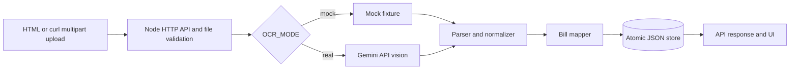

# OCR Bill Proof of Concept

## 1. Mục tiêu PoC

PoC chứng minh một request có thể đi xuyên suốt luồng: upload ảnh hóa đơn, kiểm tra file, OCR, chuẩn hóa dữ liệu, tạo draft bill theo cấu trúc gần với Splitly, lưu bill và trả/hiển thị kết quả. PoC nằm hoàn toàn trong `poc/`, không thay đổi public API của ứng dụng chính.

## 2. Phạm vi

Đã làm: multipart upload; JPG/JPEG/PNG (và SVG chỉ để demo fixture); giới hạn 5 MB; kiểm tra MIME và file signature; Gemini API real mode; mock mode offline; parser raw text và JSON; chuẩn hóa tiền VND thành integer; cảnh báo dữ liệu thiếu/sai tổng; draft bill; JSON file store ghi nguyên tử; API tra cứu; UI tối giản; logging an toàn; unit/integration tests.

Không làm: authentication/authorization, phân chia participant, email/notification, transaction MongoDB, sửa màn hình React chính, OCR chữ viết tay, production hardening hay hỗ trợ mọi layout hóa đơn.

## 3. Kiến trúc

### Repository hiện tại

```text
web/src/pages/Bills/Ocr.jsx (file → base64)
  → web/src/apis/index.js
  → POST api /v1/bills/scan
  → api/src/validations/billValidation.js
  → api/src/services/billService.js
  → api/src/providers/GeminiProvider.js
  → frontend parseAssistantBillData
  → /create form
  → POST /v1/bills
  → billService + billModel → MongoDB
```

OCR và bill đều có code, nhưng chưa nối thành một request tự tạo bill. Scan không có auth trong route hiện tại, trong khi create bill có auth và cần các ObjectId người dùng hợp lệ. Ảnh được gửi base64, parser chính nằm ở frontend, không có test OCR/bill, và local demo bị chặn nếu thiếu Gemini, MongoDB, JWT/user seed.

### PoC



## 4. Luồng xử lý

1. Client gửi field multipart `file` tới `POST /api/poc/receipts/process`.
2. Server giới hạn body, bỏ qua filename do client cung cấp, kiểm tra MIME và magic bytes.
3. Provider mock trả fixture xác định; provider real gửi data URI nội bộ tới Gemini giống integration hiện có. Ảnh/base64 và secret không được log.
4. Normalizer nhận raw text dạng dòng hoặc structured JSON của Gemini, trim chuỗi, chuẩn hóa số tiền, ngày, item và các tổng.
5. Tổng item/subtotal/discount/tax/service fee được tính lại. Chênh lệch tạo warning và bill `NEEDS_REVIEW`, không âm thầm ghi đè total OCR.
6. Mapper tạo bill với các field gần model hiện tại: `billName`, `totalAmount`, `splittingMethod: item-based`, `items[].amount`.
7. Store ghi toàn bộ snapshot vào file tạm rồi rename, tránh để file bill dở dang.
8. Response 201 chứa raw OCR, extracted data, bill và warnings; UI hiển thị toàn bộ. Có thể GET lại bill theo id.

## 5. Công nghệ sử dụng

- Runtime/backend: Node.js 20+, built-in `http`, `fetch`, `FormData`, `crypto`, `fs`; không có package runtime bên ngoài.
- OCR real: Google Gemini API vision endpoint đang được ứng dụng chính sử dụng.
- OCR mock: fixture tách biệt, chỉ dành cho demo/test offline.
- Frontend: HTML/CSS/JavaScript tối giản được chính service phục vụ.
- Persistence: JSON file store cho PoC. Ứng dụng chính vẫn dùng MongoDB native driver.
- Test: built-in `node:test`.

## 6. Cách cấu hình

Sao chép `.env.example` thành `.env`. Mặc định:

```env
OCR_MODE=mock
PORT=8088
MAX_FILE_SIZE_BYTES=5242880
BILL_STORE_FILE=./data/bills.json
```

OCR thật:

```env
OCR_MODE=real
GEMINI_API_KEY=replace-with-secret
GEMINI_MODEL=gemini-3.1-flash-lite
```

Không commit `.env`. Logger lọc tên field chứa key, token, base64, raw text hoặc image.

## 7. Cách chạy

Không cần migrate database và không cần chạy backend/frontend chính cho PoC độc lập.

```powershell
cd poc
Copy-Item .env.example .env
npm.cmd ci
npm.cmd run lint
npm.cmd test
npm.cmd run build
npm.cmd start
```

Trên bash/macOS/Linux dùng `npm` thay `npm.cmd` và `cp .env.example .env`. UI chạy tại `http://127.0.0.1:8088`.

Nếu port đã được sử dụng, đổi `PORT` trong `.env`. Có thể kiểm tra trên Windows bằng `Get-NetTCPConnection -LocalPort 8088 -State Listen`.

Ứng dụng chính, nếu cần chạy riêng, vẫn theo README gốc: `cd api && npm install && npm run dev`, sau đó `cd web && npm install && npm run dev`; PoC không yêu cầu migrate MongoDB.

## 8. Cách demo

UI: mở `http://127.0.0.1:8088`, chọn `samples/receipt.svg`, bấm **Process receipt**. SVG chỉ dùng với mock mode. Real mode dùng ảnh JPG/PNG hóa đơn thật.

PowerShell:

```powershell
curl.exe -X POST http://127.0.0.1:8088/api/poc/receipts/process -F "file=@samples/receipt.svg;type=image/svg+xml"
```

Bash:

```bash
curl -X POST http://127.0.0.1:8088/api/poc/receipts/process \
  -F "file=@samples/receipt.svg;type=image/svg+xml"
```

Tra cứu lại bill: `GET http://127.0.0.1:8088/api/poc/bills/{bill.id}`. Dữ liệu cũng nằm tại `data/bills.json`.

## 9. Kết quả mong đợi

Response rút gọn:

```json
{
  "success": true,
  "ocr": { "provider": "mock-fixture", "rawText": "SPLITLY COFFEE...", "confidence": 0.96 },
  "extractedData": {
    "merchantName": "SPLITLY COFFEE",
    "currency": "VND",
    "items": [
      { "name": "Ca phe sua", "quantity": 2, "unitPrice": 35000, "lineTotal": 70000 }
    ],
    "subtotal": 100000,
    "discount": 10000,
    "total": 90000
  },
  "bill": { "status": "DRAFT", "splittingMethod": "item-based", "totalAmount": 90000 },
  "warnings": []
}
```

## 10. Test cases

- Chuẩn hóa `35.000 ₫` và `100,000 VND`.
- Parse receipt raw text happy path.
- Normalize structured JSON của Gemini.
- Map extracted data sang bill/items.
- Thiếu merchant và items vẫn trả kết quả kèm warnings.
- Total không khớp tổng tính lại tạo warning cần xác nhận.
- Multipart file type không hợp lệ trả 415.
- OCR provider lỗi trả lỗi 502 có cấu trúc.
- Integration happy path upload → OCR → normalize → create/store → GET bill.

Unit test không gọi OCR thật.

## 11. Hạn chế của PoC

- Mock mode chứng minh orchestration, không đọc pixel ảnh; không được xem là bằng chứng về độ chính xác OCR.
- Real mode chưa được xác nhận nếu không có Gemini key hợp lệ và có thể phát sinh chi phí.
- Parser text dùng format item phân cách bằng `|`; structured JSON được khuyến nghị với Gemini.
- JSON store phù hợp demo một process, không thay MongoDB/transaction/locking production.
- SVG sample không dùng được ở real mode; real mode chỉ nhận JPG/JPEG/PNG.
- Bill chưa có creator/payer/participants vì PoC không seed user hay auth; do đó chưa insert trực tiếp vào collection `bills` của ứng dụng chính.
- Chưa hỗ trợ mọi currency decimal, layout, hóa đơn viết tay hoặc ảnh chất lượng thấp.

## 12. Kết luận

PoC mock đã chạy thành công trong môi trường phát triển ngày 18/07/2026: lint/build pass, 9/9 test pass, request mẫu trả HTTP 201 với 2 items và total 90.000 VND, sau đó GET lại đúng bill đã lưu. Nó chứng minh contract và orchestration end-to-end từ upload đến một draft bill bền vững, kiểm tra item/total và error path. Real mode chưa được chạy vì repository không cung cấp Gemini key; vì vậy PoC chưa chứng minh độ chính xác OCR thật. Rủi ro còn lại lớn nhất là chất lượng/chi phí của Gemini trên hóa đơn thật và mapping user/participant khi tích hợp MongoDB chính.

Bước tiếp theo đề xuất: chạy bộ ảnh hóa đơn thật với `OCR_MODE=real`, đo precision theo field; sau đó đưa normalizer vào backend chính và tạo một authenticated endpoint dùng MongoDB transaction hoặc một lệnh insert bill duy nhất với creator/payer đã xác thực.
